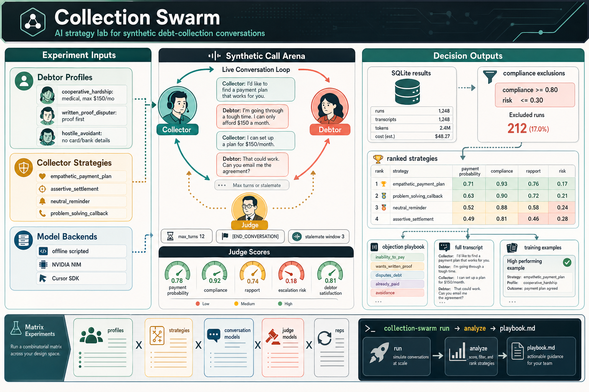

<p align="center">
  
</p>

<h1 align="center">Collection Swarm</h1>

<p align="center">
  <strong>AI-driven simulator for testing debt-collection strategies before they ever touch a real customer.</strong>
</p>

<p align="center">
  <a href="#quick-start">Quick Start</a>&ensp;·&ensp;
  <a href="#how-it-works">How It Works</a>&ensp;·&ensp;
  <a href="#web-dashboard">Dashboard</a>&ensp;·&ensp;
  <a href="#cli-reference">CLI Reference</a>&ensp;·&ensp;
  <a href="#model-configuration">Models</a>&ensp;·&ensp;
  <a href="#architecture">Architecture</a>
</p>

---

Collection Swarm runs synthetic multi-turn conversations between three AI roles — **Collector**, **Debtor**, and **Judge** — to measure what actually works across debtor archetypes, negotiation strategies, and model providers. Results are persisted to SQLite, surfaced in a web dashboard, and distilled into a Markdown playbook that ranks strategies, flags compliance risk, and highlights the best-performing approaches.

## Why It Exists

Collection teams need to improve outcomes without experimenting on real people. There is no scalable way to A/B test conversation strategies against every debtor archetype. Collection Swarm solves that by simulating the entire space with fully synthetic data.

Use it to answer questions like:

- Which strategy works best for hardship profiles?
- Which approaches trigger compliance risk?
- Which model is better at role-playing debtors versus judging outcomes?
- What transcripts should become training examples?
- How do strategy changes affect payment probability and debtor satisfaction?

## Quick Start

### Prerequisites

| Dependency | Version | Required for |
|------------|---------|-------------|
| Python     | 3.12+   | All modes   |
| Node.js    | 22+     | Cursor SDK backend |
| NVIDIA NIM API key | —  | NIM backend |
| Cursor API key | —  | Cursor SDK backend |

### 1. Install

```bash
pip install -e ".[dev]"
```

### 2. Run Offline (no API keys needed)

```bash
collection-swarm simulate \
  --profile cooperative_hardship \
  --strategy empathetic_payment_plan
```

You should see a full collector/debtor transcript followed by a judgment table in the terminal.

### 3. Run with Live Models

Create a `.env` file in the repo root:

```bash
NVIDIA_NIM_API_KEY=your_nvidia_key
CURSOR_API_KEY=your_cursor_key
```

Alternatively, store keys via the dashboard Settings page or the CLI:

```bash
collection-swarm set-key NVIDIA_NIM_API_KEY
collection-swarm set-key CURSOR_API_KEY
```

Install the Cursor SDK bridge:

```bash
cd cursor_sdk_bridge && npm install && cd ..
```

Run a live simulation:

```bash
collection-swarm simulate \
  --profile cooperative_hardship \
  --strategy empathetic_payment_plan \
  --conversation-model nim-mistral-large-3-675b \
  --judge-model cursor-claude-4.6-opus-high-thinking \
  --no-save
```

Remove `--no-save` to persist the result to SQLite.

## How It Works

Each simulation produces:

- A full collector/debtor **transcript**.
- **Termination metadata** — who ended the conversation, how many turns it took, and whether a stalemate was detected.
- A **structured judgment** with the following metrics:

| Metric | Type | Description |
|--------|------|-------------|
| `payment_outcome` | categorical | Whether a payment arrangement was reached |
| `payment_probability` | 0–1 | Likelihood the debtor will follow through |
| `debtor_satisfaction` | 0–1 | How the debtor perceived the interaction |
| `compliance_score` | 0–1 | Adherence to regulatory standards (FDCPA, etc.) |
| `conversation_efficiency` | 0–1 | Economy of turns relative to outcome |
| `rapport_built` | 0–1 | Quality of the working relationship |
| `escalation_risk` | 0–1 | Likelihood of complaint or litigation |
| `constraint_violations` | list | Debtor-profile constraints the conversation broke |

- **Token and cost metadata** where providers expose it.

Saved results go to `output/collection_swarm.sqlite` by default.

## Debtor Profiles & Collector Strategies

The bundled catalog is calibrated to **Will Bank's** real client base and the
post-liquidation Brazilian context (BCB extrajudicial liquidation decreed
2026-01-21). Sources, behavioral-economics references, and the rationale for
every persona and strategy are documented in
[`docs/willbank-research-dossier.md`](docs/willbank-research-dossier.md).

### Included Profiles (R$ amounts)

| ID | Archetype | Debt | Primary Objection |
|----|-----------|------|-------------------|
| `cooperative_hardship` | Cooperative | R$ 850 crédito pessoal Will | Inability to pay — strict R$ 80/mês ceiling |
| `written_proof_disputer` | Disputer | R$ 612 cartão Will | Disputes fees — demands fatura detalhada + contrato |
| `hostile_avoidant` | Hostile | R$ 1 900 cartão Will | Avoidance — refuses to share data on the call |
| `liquidation_confused` | Confused | R$ 540 cartão Will | Questions whether debt still exists post-liquidation |
| `scam_suspicious` | Skeptical | R$ 1 280 cartão Will | Suspects scam — needs liquidator validation first |
| `feirao_serial_renegotiator` | Strategic | R$ 2 750 cartão Will | Anchors on Feirão-style 70%+ discounts |
| `consignado_payroll_steady` | Cooperative | R$ 4 200 FGTS antecipado | Reassurance only; descontos seguem pela folha |
| `superendividado_chronic` | Overwhelmed | R$ 980 cartão Will | Multi-credor — Lei 14.181/2021 candidate |
| `young_first_credit_card` | Cooperative | R$ 320 cartão Will | Forgetful — first card; resolve via WhatsApp |
| `willbank_blocked_balance_hardship` | Anxious hardship | R$ 930 cartão Will | Salary/reserve blocked by liquidation; protects essentials |
| `willbank_micro_merchant_cashflow` | Pragmatic micro-merchant | R$ 1 480 card spend | Irregular sales cash flow after Pix/card disruption |
| `willbank_benefit_dependent_household` | Vulnerable hardship | R$ 760 card + bills | Benefits and essential expenses take priority |
| `willbank_fgc_waiting_high_balance` | Angry reimbursement-waiting | R$ 3 900 card installments | Will pay after FGC/liquidator milestone |
| `willbank_low_digital_access` | Low digital access | R$ 520 card invoice | Cannot access app or generate boleto unaided |
| `willbank_blocked_balance_hardship` | Anxious hardship | R$ 930 cartão Will | Blocked salary/reserve — needs low-entry boleto plan |
| `willbank_micro_merchant_cashflow` | Pragmatic merchant | R$ 1 480 cartão Will | Irregular post-liquidation cash flow |
| `willbank_benefit_dependent_household` | Vulnerable hardship | R$ 760 cartão/basic bills | Essential expenses take priority |
| `willbank_fgc_waiting_high_balance` | Angry/high balance | R$ 3 900 cartão Will | Will pay after FGC/liquidator milestone |
| `willbank_low_digital_access` | Low digital access | R$ 520 cartão Will | Cannot access app or generate boleto |

### Included Strategies

| ID | Tone | Tactic | Follow-up |
|----|------|--------|-----------|
| `empathetic_payment_plan` | Empathetic | Payment plan (parcela alinhada ao dia 5) | Written agreement |
| `assertive_settlement` | Assertive | Loss-framed Feirão-style discount | Immediate boleto |
| `neutral_reminder` | Neutral | Personalized digital reminder | Self-service link |
| `problem_solving_callback` | Empathetic | Empathy + implementation intention | Scheduled callback |
| `liquidation_explainer` | Calm informative | Defer until validated; cite liquidator | Callback after validation |
| `whatsapp_self_service` | Friendly brief | Link to self-negotiation portal | Portal self-service |
| `superendividamento_referral` | Empathetic | Refer to Lei 14.181 audiência | Hold pattern + referral |
| `consignado_confirmation` | Calm informative | Confirm and inform; no ask | Written confirmation |
| `blocked_balance_hardship_plan` | Empathetic practical | Micro-installment with fee review | Low-entry plan after boleto confirmation |
| `micro_merchant_cashflow_alignment` | Collaborative businesslike | Weekly/payday-aligned installments | Written schedule with review date |
| `overindebtedness_stabilization` | Nonjudgmental structured | One recommended option | Documented hardship review |
| `reimbursement_milestone_callback` | Calm respectful | Bridge agreement until reimbursement | Callback tied to official milestone |
| `low_digital_access_guidance` | Patient step-by-step | Assisted official-channel resolution | Written step-by-step instructions |
| `blocked_balance_hardship_plan` | Empathetic practical | Micro-installment + fee review | Low-entry boleto path |
| `micro_merchant_cashflow_alignment` | Collaborative | Weekly/payday-aligned installments | Written schedule review |
| `overindebtedness_stabilization` | Nonjudgmental | One recommended default option | Documented hardship review |
| `reimbursement_milestone_callback` | Calm respectful | Bridge until reimbursement | Official-milestone callback |
| `low_digital_access_guidance` | Patient | Step-by-step boleto guidance | Written instructions |

Profiles and strategies are defined in YAML and are fully extensible — add your own in `config/debtor_profiles.yaml` and `config/collector_strategies.yaml`.

### Explore from the CLI

```bash
collection-swarm list-profiles
collection-swarm list-strategies
```

## Web Dashboard

Collection Swarm ships with a built-in web dashboard for browsing results, launching simulations, running matrix sweeps, and generating reports — no CLI required.

```bash
# Seed demo data (optional)
collection-swarm seed --count 24

# Start the dashboard
collection-swarm serve
```

Then open [http://127.0.0.1:8000](http://127.0.0.1:8000).

## CLI Reference

| Command | Description |
|---------|-------------|
| `simulate` | Run a single simulation and print transcript + judgment |
| `run` | Run a matrix of simulations across profiles, strategies, and models |
| `analyze` | Generate a Markdown playbook from completed simulations |
| `model-report` | Generate a model-role evaluation report (offline or with live probes) |
| `list-profiles` | List configured debtor profiles |
| `list-strategies` | List configured collector strategies |
| `test-connection` | Verify the default model backend is reachable |
| `serve` | Launch the web dashboard |
| `set-key` | Store an API key in the encrypted local database |
| `list-keys` | Show which API keys are configured (database, environment, or not set) |
| `remove-key` | Remove a stored API key from the database |
| `seed` | Generate realistic demo data for the dashboard |

### Run a Matrix

Run every combination of profiles, strategies, models, and repetitions in a single command:

```bash
collection-swarm run \
  --profiles cooperative_hardship,written_proof_disputer \
  --strategies empathetic_payment_plan,problem_solving_callback \
  --conversation-models nim-mistral-large-3-675b,cursor-gpt-5.5-medium \
  --judge-models cursor-claude-4.6-opus-high-thinking \
  --reps 2 \
  --concurrency 2
```

### Generate a Playbook

```bash
collection-swarm analyze --output output/playbook.md
```

The playbook summarizes strategy performance per profile and excludes risky combinations that fail the configured compliance thresholds (`min_compliance_score: 0.8`, `max_escalation_risk: 0.3`).

### Generate a Model-Role Report

```bash
collection-swarm model-report --output docs/cursor-model-role-report.md
```

Use `--live-probes` to run parameterized Cursor SDK probes across Collector, Debtor, and Judge roles. See [`docs/model-evaluation.md`](docs/model-evaluation.md) for the full module API, CLI parameters, and production guidance.

## Model Configuration

Models are defined in `config/models.yaml`. The user-facing `id` is what you pass to the CLI; the provider-facing `model_name` is the exact string sent to the backend.

### Conversation Models

| CLI ID | Provider | Backend Model |
|--------|----------|---------------|
| `cursor-composer-2` | Cursor SDK | `composer-2` |
| `cursor-gpt-5.5-medium` | Cursor SDK | `gpt-5.5-medium` |
| `cursor-gpt-5.4-high` | Cursor SDK | `gpt-5.4-high` |
| `cursor-gpt-5.4-high-fast` | Cursor SDK | `gpt-5.4-high-fast` |
| `cursor-gpt-5.3-codex-high` | Cursor SDK | `gpt-5.3-codex-high` |
| `cursor-gpt-5.3-codex-high-fast` | Cursor SDK | `gpt-5.3-codex-high-fast` |
| `nim-mistral-large-3-675b` | NVIDIA NIM | `mistralai/mistral-large-3-675b-instruct-2512` |
| `nim-llama-4-maverick` | NVIDIA NIM | `meta/llama-4-maverick-17b-128e-instruct` |
| `nim-minimax-m2.7` | NVIDIA NIM | `minimaxai/minimax-m2.7` |

### Judge Models

| CLI ID | Provider | Backend Model |
|--------|----------|---------------|
| `cursor-claude-4.6-opus-high-thinking` | Cursor SDK | `claude-4.6-opus-high-thinking` |
| `cursor-claude-4.6-opus-high-thinking-fast` | Cursor SDK | `claude-4.6-opus-high-thinking-fast` |
| `cursor-claude-opus-4-7-thinking-high` | Cursor SDK | `claude-opus-4-7-thinking-high` |

### Local Defaults (offline, no API keys)

| CLI ID | Description |
|--------|-------------|
| `local-scripted` | Deterministic conversation backend for offline runs |
| `local-judge` | Deterministic heuristic judge for offline runs |

## Live Backend Setup

### NVIDIA NIM

Uses LiteLLM against `https://integrate.api.nvidia.com/v1`.

```bash
NVIDIA_NIM_API_KEY=...
```

You can also store this key via the dashboard **Settings** page or with `collection-swarm set-key NVIDIA_NIM_API_KEY`.

NIM model names in `config/models.yaml` use LiteLLM's OpenAI-compatible prefix:

```yaml
model_name: openai/mistralai/mistral-large-3-675b-instruct-2512
```

### Cursor SDK

Uses the official [`@cursor/sdk`](https://github.com/cursor/cookbook) through the Node bridge in `cursor_sdk_bridge/`.

```bash
CURSOR_API_KEY=...
CURSOR_SDK_WORKSPACE=C:\path\to\workspace  # optional; defaults to cwd
```

You can also store this key via the dashboard **Settings** page or with `collection-swarm set-key CURSOR_API_KEY`.

Requirements: Node.js 22+ and `npm install` inside `cursor_sdk_bridge/`.

## Architecture

```
┌─────────────────────────────────────────────────────────┐
│  config/                                                │
│  profiles · strategies · models · prompts · simulation  │
└────────────────────────┬────────────────────────────────┘
                         │
                         ▼
                 SimulationEngine
                    │    │    │
        ┌───────────┘    │    └───────────┐
        ▼                ▼                ▼
  CollectorAgent    DebtorAgent        Judge
        │                │                │
        └───────┬────────┘                │
                ▼                         ▼
            LLMRouter ────────────────────┘
           ╱    │    ╲
     Scripted  NIM  Cursor SDK
                         │
                         ▼
                 SimulationResult
                    │         │
           ┌────────┘         └────────┐
           ▼                           ▼
     SQLite Store              Web Dashboard
           │
           ▼
  Analysis Pipeline
   ├── Statistics
   ├── Compliance
   ├── Objections
   └── Playbook
```

### Key Modules

| Path | Responsibility |
|------|----------------|
| `src/collection_swarm/engine.py` | Conversation loop, turn limit, end-signal parsing, stalemate detection |
| `src/collection_swarm/agents/` | Collector, debtor, and judge prompt rendering |
| `src/collection_swarm/backends/` | Model backend implementations (scripted, NIM, Cursor SDK) and router |
| `src/collection_swarm/store.py` | SQLite persistence |
| `src/collection_swarm/analysis/` | Compliance filters, statistics, objection taxonomy, and playbook generation |
| `src/collection_swarm/runner.py` | Matrix builder and concurrent runner |
| `src/collection_swarm/model_evaluation.py` | Cursor SDK model-role probing and report generation |
| `src/collection_swarm/web/` | FastAPI dashboard with live simulation, matrix runs, and reporting |
| `src/collection_swarm/secrets.py` | Encrypted API key storage and resolution |
| `src/collection_swarm/cli.py` | Click CLI entry point |
| `config/` | YAML configuration for profiles, strategies, models, prompts, and simulation parameters |

## Configuration

```
config/
├── collector_strategies.yaml   # Strategy definitions for Collector behavior
├── debtor_profiles.yaml        # Synthetic debtor profiles, constraints, objections
├── models.yaml                 # Local, NIM, and Cursor SDK model routing
├── prompts.yaml                # Collector, Debtor, and Judge prompt templates
└── simulation.yaml             # Turn limits, repetitions, compliance thresholds
```

A key design choice: debtor profiles include **machine-readable constraints**. For example, `cooperative_hardship` will never agree above R$ 80/mês. The Judge verifies that constraint deterministically in addition to LLM scoring — if the debtor violates its own constraints, the simulation data is flagged as unreliable.

## Development

### Running Tests

```bash
pytest -q
```

The test suite (12 files, 21+ tests) covers:

- Config loading and validation
- Domain model serialization
- Conversation engine behavior and stalemate detection
- Router/backend wiring
- Judge parsing and constraint checks
- SQLite storage
- Runner matrix generation
- Playbook generation
- Cursor SDK backend
- Model evaluation pipeline
- CLI commands
- Web dashboard API

### Project Layout

```
collection-swarm/
├── src/collection_swarm/       # Main package
│   ├── agents/                 # Collector, Debtor, Judge agents
│   ├── analysis/               # Compliance, statistics, objections, playbook
│   ├── backends/               # LLM backends: scripted, NIM, Cursor SDK
│   ├── web/                    # FastAPI dashboard + static assets
│   ├── cli.py                  # CLI entry point
│   ├── config.py               # YAML config loader
│   ├── engine.py               # Simulation engine
│   ├── models.py               # Domain models (Pydantic)
│   ├── runner.py               # Matrix runner
│   ├── secrets.py              # Encrypted API key storage
│   └── store.py                # SQLite store
├── config/                     # YAML configuration
├── cursor_sdk_bridge/          # Node.js bridge for Cursor SDK
├── tests/                      # Test suite
├── docs/                       # Generated reports and evaluation docs
├── assets/                     # Images and infographics
└── pyproject.toml              # Package definition
```

## Troubleshooting

<details>
<summary><code>CURSOR_API_KEY is required</code></summary>

Add `CURSOR_API_KEY` to a `.env` file in the repo root, export it in your shell, or store it via the dashboard **Settings** page or `collection-swarm set-key CURSOR_API_KEY`.
</details>

<details>
<summary><code>NVIDIA_NIM_API_KEY is required</code></summary>

Add `NVIDIA_NIM_API_KEY` to `.env`, export it in your shell, or store it via the dashboard **Settings** page or `collection-swarm set-key NVIDIA_NIM_API_KEY`.
</details>

<details>
<summary>Cursor SDK calls fail immediately</summary>

Verify:
- Node.js is version 22 or newer.
- `npm install` has been run inside `cursor_sdk_bridge/`.
- `CURSOR_API_KEY` is valid.
- The `model_name` exists in Cursor SDK's model list.
</details>

<details>
<summary>NIM returns 404</summary>

The NIM model string is probably stale. Query NVIDIA's `/v1/models` endpoint and update `config/models.yaml`.
</details>

<details>
<summary>Live simulations are slow</summary>

Live runs make multiple sequential model calls per simulation (collector turns + debtor turns + judge). Cursor SDK calls can be slower than NIM. Use lower `--reps`, lower `--concurrency`, or the local scripted models while iterating.
</details>

## Data and Safety

Collection Swarm is for **synthetic testing only**.

- **Do not** use real consumer data in profiles or transcripts.
- **Do not** treat Judge output as legal advice.
- Keep compliance guardrails in collector strategies.
- Review generated playbooks before using them for policy or training decisions.
- Confirm applicable debt-collection law and internal policy with qualified counsel.

## Repository Hygiene

Generated and local-only files are gitignored:

- `.env` — API keys
- `.collection_swarm.key` — encryption key for stored API secrets
- `output/` — SQLite databases and generated playbooks
- `cursor_sdk_bridge/node_modules/`
- Python build artifacts (`*.egg-info`, `__pycache__`, `dist/`)

Commit config, code, tests, and docs. Never commit API keys or generated databases.
