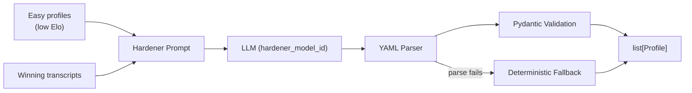

# Adversarial Hardening

::: collection_swarm.adversarial

The adversarial module generates harder debtor profiles by analyzing which profiles are too easily defeated by collection strategies. It uses an LLM to create tougher profile variants that better stress-test strategies before deployment.

---

## Overview



The adversarial hardening loop is the profile-side counterpart to [strategy evolution](evolution.md). While evolution improves strategies, hardening makes profiles more resistant, creating an arms race that drives both sides toward robust behavior.

---

## API

### `harden_profiles()`

```python
async def harden_profiles(
    easy_profiles: list[Profile],
    winning_transcripts: list[str],
    config: HardeningConfig,
    router,
) -> list[Profile]
```

Generate harder variants of debtor profiles using an LLM.

**Parameters**

| Parameter | Type | Description |
|---|---|---|
| `easy_profiles` | `list[Profile]` | Profiles with low Elo ratings (easily defeated) |
| `winning_transcripts` | `list[str]` | Transcripts where strategies successfully collected from these profiles |
| `config` | `HardeningConfig` | Hardening configuration parameters |
| `router` | `LLMRouter` | LLM backend router for making completion calls |

**Returns:** A `list[Profile]` of hardened profile variants with `hard_`-prefixed IDs.

---

## Hardener Prompt

The prompt instructs the LLM to create harder-but-realistic profile variants:

```
Create harder but realistic debtor profile variants. Preserve each seed
archetype unless a coherent reason is given.

SEED PROFILES:
[serialized profile data]

WINNING TRANSCRIPTS:
[up to 5 transcript excerpts]

Return YAML as: profiles: [profile objects].
```

!!! note "Archetype Preservation"
    The prompt explicitly asks the LLM to preserve the seed archetype. A `cooperative_hardship` profile should remain cooperative but with harder constraints — not transform into a completely different debtor type.

---

## YAML Parsing

The parser handles multiple output formats from the LLM:

```python
def _parse_hardened_profiles(output: str) -> list[dict]:
    match = re.search(r"```(?:yaml)?\s*(.*?)```", output, re.DOTALL)
    text = match.group(1) if match else output
    data = yaml.safe_load(text)
    ...
```

| LLM Output Format | Handling |
|---|---|
| ` ```yaml\nprofiles:\n  - ...``` ` | Code fence stripped, `profiles` key extracted |
| `profiles:\n  - ...` | `profiles` key extracted directly |
| `- id: ...\n  ...` | Bare list parsed as profile list |
| Unparseable text | Returns empty list → triggers fallback |

Each parsed dict is validated through `Profile.model_validate()`. Invalid entries are silently skipped via `ValidationError` handling.

---

## Profile ID Convention

Hardened profiles receive IDs prefixed with `hard_`, incorporating the parent profile ID:

```
hard_{parent_id}_{6-char-hex}
```

For example: `hard_cooperative_hardship_a3f2b1`

---

## Fallback Profile

When the LLM returns unparseable output or no valid profiles can be extracted, the module creates a **deterministic fallback**:

```python
def _fallback_profile(profiles: list[Profile]) -> Profile:
    parent = profiles[0]
    constraints = [*parent.constraints]
    constraints.append(
        Constraint(text="Só aceitará avançar após receber confirmação oficial por escrito.")
    )
    return parent.model_copy(
        update={
            "id": f"hard_{parent.id}_{uuid4().hex[:6]}",
            "responsiveness": "medium",
            "primary_objection": "official_channel_request",
            "constraints": constraints,
        }
    )
```

The fallback applies a specific hardening pattern:

| Field | Original | Hardened |
|---|---|---|
| `id` | `cooperative_hardship` | `hard_cooperative_hardship_a3f2b1` |
| `responsiveness` | (varies) | `"medium"` |
| `primary_objection` | (varies) | `"official_channel_request"` |
| `constraints` | existing list | existing + written confirmation constraint |

!!! info "Fallback Constraint"
    The appended constraint is in Portuguese: *"Só aceitará avançar após receber confirmação oficial por escrito"* — "Will only proceed after receiving official written confirmation." This creates a concrete behavioral hurdle that forces strategies to handle documentation requests.

!!! failure "Empty Input"
    Raises `ValueError` if `profiles` is empty — at least one parent is required to create a fallback.

---

## `HardeningConfig`

```python
class HardeningConfig(BaseModel):
    enabled: bool = False
    hardener_model_id: str | None = None
    max_drift: float = 200.0
    realism_check: bool = False
```

| Field | Default | Description |
|---|---|---|
| `enabled` | `False` | Whether adversarial hardening is active |
| `hardener_model_id` | `None` | LLM model ID for hardening. Falls back to `"local-scripted"` if `None` |
| `max_drift` | `200.0` | Maximum Elo drift allowed before re-hardening triggers |
| `realism_check` | `False` | Whether to validate that hardened profiles remain realistic |

---

## Evolution vs. Hardening

The two adversarial modules form a co-evolutionary loop:

```
         ┌─────────────────────────────────┐
         │        Tournament Round         │
         │  Strategies vs. Profiles (Elo)  │
         └──────────┬──────────────┬───────┘
                    │              │
          Low-rated strategies   Low-rated profiles
                    │              │
                    ▼              ▼
         ┌──────────────┐  ┌──────────────┐
         │   Evolution  │  │  Hardening   │
         │  (improve    │  │  (toughen    │
         │   strategies)│  │   profiles)  │
         └──────────────┘  └──────────────┘
                    │              │
                    ▼              ▼
         ┌─────────────────────────────────┐
         │       Next Tournament Round     │
         └─────────────────────────────────┘
```

| Aspect | Evolution | Hardening |
|---|---|---|
| **Target** | Strategies | Profiles |
| **Input** | Top + bottom strategies, failure transcripts | Easy profiles, winning transcripts |
| **ID prefix** | `evo_` | `hard_` |
| **Fallback** | Copy top strategy with new ID | Add written-confirmation constraint |
| **Goal** | Better collection approaches | More resistant debtors |
