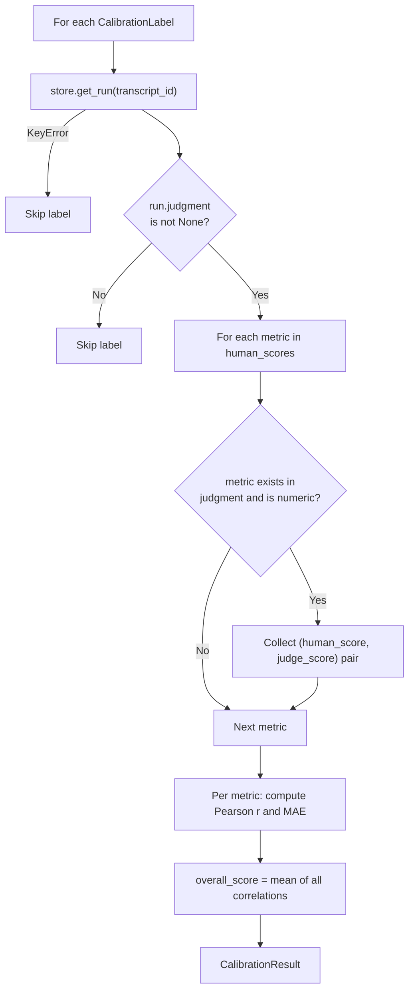

# Judge Calibration

::: collection_swarm.calibration

The calibration module measures how well the automated Judge aligns with human evaluators. It compares human-labeled scores against the Judge's stored judgments using Pearson correlation and mean absolute error (MAE) per metric.

---

## Why Calibrate?

The Judge agent produces numerical scores (payment probability, compliance, escalation risk, etc.) that drive strategy rankings, compliance exclusions, and playbook generation. If these scores systematically deviate from human judgment, every downstream decision is compromised.

Calibration answers: **Does the Judge agree with human experts, and by how much does it disagree?**

---

## Data Model

### `CalibrationLabel`

A single human evaluation of one transcript.

```python
class CalibrationLabel(BaseModel):
    transcript_id: str
    human_scores: dict[str, float]
    labeler_id: str
    timestamp: datetime = Field(
        default_factory=lambda: datetime.now(timezone.utc)
    )
```

| Field | Type | Description |
|---|---|---|
| `transcript_id` | `str` | The simulation run ID this label applies to |
| `human_scores` | `dict[str, float]` | Metric name → human score (0.0–1.0) |
| `labeler_id` | `str` | Identifier for the human labeler |
| `timestamp` | `datetime` | When the label was created (defaults to UTC now) |

!!! warning "Score Validation"
    All values in `human_scores` must be between 0.0 and 1.0 inclusive. The `@field_validator` raises `ValueError` for out-of-range scores.

**Example label:**

```json
{
    "transcript_id": "sim_20260501_001",
    "human_scores": {
        "payment_probability": 0.6,
        "compliance_score": 0.85,
        "escalation_risk": 0.2
    },
    "labeler_id": "analyst_jane",
    "timestamp": "2026-05-01T14:30:00Z"
}
```

---

### `CalibrationResult`

The output of the calibration evaluation.

```python
class CalibrationResult(BaseModel):
    correlations: dict[str, float]
    mae: dict[str, float]
    overall_score: float
    label_count: int
```

| Field | Type | Description |
|---|---|---|
| `correlations` | `dict[str, float]` | Pearson correlation per metric (−1.0 to 1.0) |
| `mae` | `dict[str, float]` | Mean absolute error per metric (0.0 to 1.0) |
| `overall_score` | `float` | Mean of all per-metric correlations |
| `label_count` | `int` | Number of labels that matched a stored simulation run with a judgment |

**Interpreting results:**

| Correlation | Interpretation |
|---|---|
| > 0.8 | Strong agreement — Judge is well-calibrated for this metric |
| 0.5 – 0.8 | Moderate agreement — usable but monitor |
| < 0.5 | Weak agreement — Judge may need prompt tuning or model change |

| MAE | Interpretation |
|---|---|
| < 0.1 | Excellent — scores rarely differ by more than 10% |
| 0.1 – 0.2 | Acceptable — occasional disagreements |
| > 0.2 | Concerning — systematic scoring drift |

---

## API

### `load_calibration_labels()`

```python
def load_calibration_labels(path: Path | str) -> list[CalibrationLabel]
```

Load calibration labels from a JSON file.

**Parameters**

| Parameter | Type | Description |
|---|---|---|
| `path` | `Path \| str` | Path to a JSON file containing an array of label objects |

**Returns:** A `list[CalibrationLabel]` validated through Pydantic.

**Expected JSON format:**

```json
[
    {
        "transcript_id": "sim_001",
        "human_scores": {"payment_probability": 0.6, "compliance_score": 0.9},
        "labeler_id": "analyst_jane"
    },
    {
        "transcript_id": "sim_002",
        "human_scores": {"payment_probability": 0.3, "compliance_score": 0.7},
        "labeler_id": "analyst_bob"
    }
]
```

---

### `pearson_correlation()`

```python
def pearson_correlation(xs: list[float], ys: list[float]) -> float
```

Compute the Pearson correlation coefficient between two equal-length lists.

$$r = \frac{\sum_{i=1}^{n}(x_i - \bar{x})(y_i - \bar{y})}{\sqrt{\sum_{i=1}^{n}(x_i - \bar{x})^2} \cdot \sqrt{\sum_{i=1}^{n}(y_i - \bar{y})^2}}$$

**Edge cases:**

| Condition | Return Value |
|---|---|
| Empty lists | `0.0` |
| Mismatched lengths | `0.0` |
| Zero variance in either list | `0.0` |

!!! info "Manual Implementation"
    This is a manual implementation with no external dependencies (no NumPy/SciPy). It uses `math.sqrt` and `zip(..., strict=True)` for safety.

---

### `evaluate_judge()`

```python
def evaluate_judge(
    labels: list[CalibrationLabel],
    store: SimulationStore,
) -> CalibrationResult
```

Compare human labels against stored Judge scores and compute per-metric statistics.

**Parameters**

| Parameter | Type | Description |
|---|---|---|
| `labels` | `list[CalibrationLabel]` | Human evaluation labels |
| `store` | `SimulationStore` | Store containing simulation runs with Judge judgments |

**Returns:** A `CalibrationResult` with correlations, MAE, and overall score.

**Algorithm:**



1. For each label, the corresponding simulation run is fetched from the store.
2. Labels with missing runs or `None` judgments are skipped.
3. For each metric in `human_scores`, the corresponding field in the Judge's `Judgment` is looked up.
4. Matched `(human, judge)` score pairs are collected per metric.
5. Pearson correlation and MAE are computed for each metric.
6. The `overall_score` is the mean of all per-metric correlations.

---

## End-to-End Example

```python
from pathlib import Path
from collection_swarm.calibration import load_calibration_labels, evaluate_judge
from collection_swarm.store import SimulationStore

labels = load_calibration_labels(Path("data/calibration_labels.json"))
store = SimulationStore("output/simulations.db")

result = evaluate_judge(labels, store)

print(f"Labels matched: {result.label_count}")
print(f"Overall correlation: {result.overall_score:.3f}")
for metric in result.correlations:
    print(
        f"  {metric}: r={result.correlations[metric]:.3f}, "
        f"MAE={result.mae[metric]:.3f}"
    )
```

**Sample output:**

```
Labels matched: 25
Overall correlation: 0.782
  payment_probability: r=0.834, MAE=0.092
  compliance_score: r=0.801, MAE=0.078
  escalation_risk: r=0.710, MAE=0.134
```
