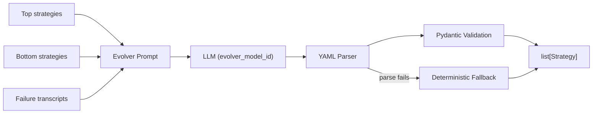

# Strategy Evolution

::: collection_swarm.evolution

The evolution module uses an LLM to generate improved collector strategies based on tournament performance. Top-performing strategies are reinforced, bottom-performing ones are analyzed for failure patterns, and the LLM produces new YAML-defined strategy variants.

---

## Overview



---

## API

### `evolve_strategies()`

```python
async def evolve_strategies(
    top_strategies: list[Strategy],
    bottom_strategies: list[Strategy],
    failure_transcripts: list[str],
    config: EvolutionConfig,
    router,
) -> list[Strategy]
```

Generate new strategies by prompting an LLM with performance data.

**Parameters**

| Parameter | Type | Description |
|---|---|---|
| `top_strategies` | `list[Strategy]` | Highest-rated strategies from the arena |
| `bottom_strategies` | `list[Strategy]` | Lowest-rated strategies from the arena |
| `failure_transcripts` | `list[str]` | Excerpts from conversations where strategies failed |
| `config` | `EvolutionConfig` | Evolution parameters (model ID, population size, etc.) |
| `router` | `LLMRouter` | LLM backend router for making completion calls |

**Returns:** A `list[Strategy]` of newly generated strategies with `evo_`-prefixed IDs.

!!! failure "Missing Model ID"
    Raises `ValueError` if `config.evolver_model_id` is not set.

---

### `cull_strategies()`

```python
def cull_strategies(
    strategy_pool: list[Strategy],
    elo_ratings: dict[str, float],
    keep_n: int,
    lineages: dict[str, StrategyLineage] | None = None,
) -> list[Strategy]
```

Reduce the strategy pool by keeping seed strategies and the top evolved strategies by Elo rating.

**Parameters**

| Parameter | Type | Default | Description |
|---|---|---|---|
| `strategy_pool` | `list[Strategy]` | — | Full pool of seed + evolved strategies |
| `elo_ratings` | `dict[str, float]` | — | Map of strategy ID → Elo rating |
| `keep_n` | `int` | — | Maximum total strategies to keep |
| `lineages` | `dict[str, StrategyLineage] \| None` | `None` | Lineage metadata for distinguishing seeds from evolved |

**Returns:** A reduced `list[Strategy]`.

**Culling Logic:**

1. **Seeds are always kept.** Strategies with no lineage entry or `generation == 0` are considered seeds and are never culled.
2. **Evolved strategies are sorted by Elo rating** (descending) and kept until the pool reaches `keep_n`.
3. If the pool is already at or below `keep_n`, no strategies are removed.

```
Pool (8 strategies)                    After cull (keep_n=5)
┌──────────────────────┐               ┌──────────────────────┐
│ seed_empathetic  ★   │──────────────▶│ seed_empathetic  ★   │
│ seed_firm        ★   │──────────────▶│ seed_firm        ★   │
│ evo_1_mutate_a3  1580│──────────────▶│ evo_1_mutate_a3  1580│
│ evo_1_mutate_b7  1540│──────────────▶│ evo_1_mutate_b7  1540│
│ evo_1_mutate_c1  1520│──────────────▶│ evo_1_mutate_c1  1520│
│ evo_1_mutate_d9  1490│  ╳ culled     │                      │
│ evo_1_mutate_e2  1470│  ╳ culled     │                      │
│ evo_1_mutate_f5  1430│  ╳ culled     │                      │
└──────────────────────┘               └──────────────────────┘
★ = seed (always kept)
```

---

## Evolver Prompt

The prompt sent to the LLM includes three sections:

1. **Top strategies** — serialized as YAML via `yaml.safe_dump()`.
2. **Bottom strategies** — serialized as YAML.
3. **Failure excerpts** — up to 5 transcript excerpts showing strategy failures.

```
Generate improved debt collection strategies as YAML under a top-level 'strategies' key.
Top strategies:
<YAML dump of top strategies>
Bottom strategies:
<YAML dump of bottom strategies>
Failure excerpts:
<YAML dump of up to 5 transcripts>
```

The LLM is expected to return a YAML document with a top-level `strategies` key containing a list of strategy objects.

---

## YAML Parsing

The module handles several edge cases when parsing LLM output:

```python
def _parse_evolved_strategies(llm_output: str) -> list[dict[str, Any]]:
    text = _extract_yaml_block(llm_output)  # strips ```yaml ... ``` fences
    parsed = yaml.safe_load(text)
    items = parsed.get("strategies", parsed if isinstance(parsed, list) else [])
    return [item for item in items if isinstance(item, dict)]
```

| LLM Output Format | Handling |
|---|---|
| ` ```yaml\nstrategies:\n  - ...``` ` | Code fence stripped, `strategies` key extracted |
| `strategies:\n  - ...` | `strategies` key extracted directly |
| `- id: ...\n  ...` | Bare list parsed as strategy list |
| Unparseable text | Returns empty list → triggers fallback |

---

## Strategy ID Convention

All evolved strategies receive IDs prefixed with `evo_`:

```
evo_1_mutate_{6-char-hex}
```

If the LLM provides an `id` that doesn't start with `evo_`, it is replaced with a generated one. If no `id` is provided, one is generated automatically.

---

## Fallback Strategy

When the LLM returns unparseable output or no valid strategies can be extracted, the module creates a **deterministic fallback mutation**:

```python
def _fallback_strategy(top: list[Strategy], bottom: list[Strategy]) -> Strategy:
    parent = top[0] if top else bottom[0]
    return parent.model_copy(
        update={
            "id": f"evo_1_mutate_{uuid4().hex[:6]}",
            "rationale": "Fallback deterministic mutation generated when the evolver did not return YAML.",
        }
    )
```

!!! info "Fallback Guarantees"
    - The fallback always returns exactly one strategy.
    - It copies the top-ranked parent strategy and only changes the `id` and `rationale`.
    - Raises `ValueError` if both `top` and `bottom` are empty.

---

## `EvolutionConfig`

```python
class EvolutionConfig(BaseModel):
    population_size: int = 20      # ge=1
    top_k: int = 3                 # ge=1
    bottom_k: int = 3              # ge=1
    cull_bottom_n: int = 3         # ge=0
    mutation_rate: float = 0.5     # 0.0–1.0
    evolver_model_id: str | None = None
```

| Field | Default | Description |
|---|---|---|
| `population_size` | `20` | Target pool size |
| `top_k` | `3` | Number of top strategies to include in the evolver prompt |
| `bottom_k` | `3` | Number of bottom strategies to include in the evolver prompt |
| `cull_bottom_n` | `3` | Number of bottom strategies to remove during culling |
| `mutation_rate` | `0.5` | Controls mutation intensity (passed to LLM context) |
| `evolver_model_id` | `None` | LLM model ID to use for evolution. **Required.** |

---

## `StrategyLineage`

Tracks the genealogy of evolved strategies:

```python
class StrategyLineage(BaseModel):
    strategy_id: str
    parent_ids: list[str] = []
    generation: int = 0
    mutation_type: str = "seed"
    mutation_description: str = ""
```

| Field | Description |
|---|---|
| `strategy_id` | ID of this strategy |
| `parent_ids` | IDs of parent strategies used to generate this one |
| `generation` | `0` for seeds, incrementing for each evolution round |
| `mutation_type` | `"seed"`, `"crossover"`, `"mutation"`, etc. |
| `mutation_description` | Human-readable description of what changed |
