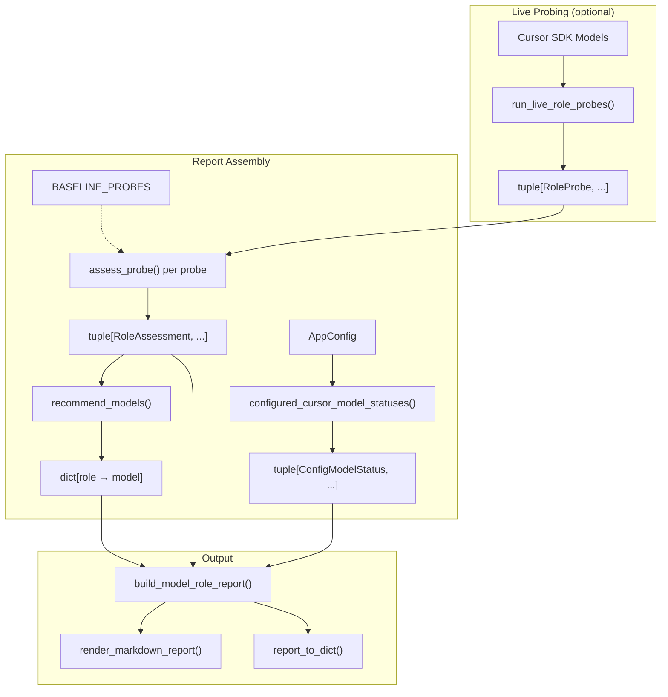

# Model Evaluation

::: collection_swarm.model_evaluation

The model evaluation module probes LLM models across all three roles (Collector, Debtor, Judge) and produces a comprehensive fitness report. It determines which models are best suited for each role using deterministic scoring heuristics, and validates that configured Cursor SDK model names are current.

---

## Overview



---

## Data Model

### `ProbeScenario`

Configurable inputs for probing models in each role.

```python
@dataclass(frozen=True)
class ProbeScenario:
    profile_id: str = "cooperative_hardship"
    strategy_id: str = "empathetic_payment_plan"
    judge_profile_id: str = "written_proof_disputer"
    debtor_prompt: str = (
        "This is an attempt to collect a debt. I see a medical balance of $1,250. "
        "What amount could you realistically afford each month?"
    )
    judge_transcript: tuple[Message, ...] = (...)
```

| Field | Default | Description |
|---|---|---|
| `profile_id` | `"cooperative_hardship"` | Profile used for Collector and Debtor probes |
| `strategy_id` | `"empathetic_payment_plan"` | Strategy used for Collector probes |
| `judge_profile_id` | `"written_proof_disputer"` | Profile used by Judge probes — stresses written-validation compliance |
| `debtor_prompt` | _(medical balance prompt)_ | Collector turn that starts the Debtor probe |
| `judge_transcript` | _(4-turn validation dialogue)_ | Completed transcript for Judge evaluation |

!!! info "Default Scenario Design"
    The default scenario uses a written-proof-requesting debtor and a cooperative collector. This stresses Judge reliability on constraint detection and parser output format — the two most common failure modes.

---

### `RoleProbe`

Raw output from one model-role probe.

```python
@dataclass(frozen=True)
class RoleProbe:
    model_name: str
    role: EvaluationRole          # "collector" | "debtor" | "judge"
    status: Literal["ok", "error"]
    elapsed_s: float | None = None
    content: str = ""
    judgment: Judgment | None = None
    error: str | None = None
```

| Field | Type | Description |
|---|---|---|
| `model_name` | `str` | Cursor SDK model name (e.g., `"gpt-5.5"`) |
| `role` | `EvaluationRole` | Which role the model was probed for |
| `status` | `"ok" \| "error"` | Whether the probe completed successfully |
| `elapsed_s` | `float \| None` | Wall-clock time for the probe |
| `content` | `str` | Generated text (for Collector and Debtor probes) |
| `judgment` | `Judgment \| None` | Parsed judgment (for Judge probes only) |
| `error` | `str \| None` | Error message if `status == "error"` |

---

### `RoleAssessment`

Deterministic fitness score derived from a probe.

```python
@dataclass(frozen=True)
class RoleAssessment:
    model_name: str
    role: EvaluationRole
    score: int           # 1–10
    fit: str             # human-readable fit label
    evidence: str        # what the model did well
    caution: str         # what to watch out for
```

**Fit labels by score:**

| Score Range | Fit Label |
|---|---|
| 9–10 | Primary recommendation |
| 7–8 | Strong candidate |
| 5–6 | Usable with caution |
| 1–4 | Avoid for now |

---

## Scoring Heuristics

### `assess_probe()`

```python
def assess_probe(probe: RoleProbe) -> RoleAssessment
```

Score a single probe on a 1–10 scale using role-specific deterministic heuristics.

!!! note "Deterministic Scoring"
    All scoring is keyword-based and deterministic. No LLM calls are made during assessment. The same probe always produces the same score.

#### Collector Scoring

| Check | Score Effect | Evidence |
|---|---|---|
| Mentions account purpose (`attempt to collect`, `outstanding`, `balance`, `account`) | +1 | "identified account purpose" |
| Includes dollar amount or "balance" | +1 | "included account detail" |
| Uses empathetic framing (`stress`, `understand`, `work with`, `manageable`) | +1 | "used empathetic payment-plan framing" |
| Leaks placeholders (`[agency`, `[collector`) | −2 | "leaked placeholders" |
| Awkward identification (`this is calling`) | −2 | "awkward caller identification" |

**Base score:** 5 | **Range after adjustments:** 1–10

#### Debtor Scoring

| Check | Score Effect | Evidence |
|---|---|---|
| Stays in hardship persona (`rent`, `hours`, `family`, `tight`, `stretched`) | +1 | "stayed in hardship persona" |
| Honors payment ceiling (≤ $150) | +1 | "honored payment ceiling" |
| Sounds realistic (`maybe`, `probably`, `realistically`, `honestly`) | +1 | "sounded like a realistic consumer" |
| Leaks markdown formatting (`**`) | −1 | "markdown formatting leaked into dialogue" |

**Base score:** 6 | **Range after adjustments:** 1–10

#### Judge Scoring

| Check | Score Effect | Evidence |
|---|---|---|
| No judgment produced | score = 1 | "No Judgment was produced." |
| Parse failed (`judge_parse_failed`) | score = 3 | "parser fallback corrupts saved metrics" |
| Returns parseable Judgment | base = 6 | "returned parseable Judgment" |
| No false constraint violations | +2 | "did not invent profile Constraint Violations" |
| Reports false violations | −1 | "reported possible false Constraint Violations" |
| High compliance + low escalation | +1 | "scores aligned with low-risk validation handling" |
| Conservative payment probability (≤ 0.5) | +1 | "did not overstate payment likelihood" |

**Base score:** 6 (if parseable) | **Range after adjustments:** 1–10

!!! warning "Judge Reliability"
    Judge scores carry extra weight in recommendations because a parser fallback (`judge_parse_failed`) corrupts saved metrics, which in turn corrupts playbook rankings and compliance exclusions. A model that scores 3 as Judge is effectively unusable for that role.

---

## Recommendations

### `recommend_models()`

```python
def recommend_models(
    assessments: tuple[RoleAssessment, ...],
) -> dict[EvaluationRole, str]
```

Pick the highest-scoring model for each role, with tie-breaking preferences.

**Tie-breaking order:**

| Role | Preference Order |
|---|---|
| Collector | `gpt-5.5` → `claude-sonnet-4-6` → `gpt-5.3-codex` → `gpt-5.4` → `gemini-3.1-pro` |
| Debtor | `gpt-5.5` → `claude-sonnet-4-6` → `claude-opus-4-7` → `gpt-5.4` → `gpt-5.3-codex` |
| Judge | `gpt-5.5` → `claude-opus-4-7` → `gpt-5.4` → `gpt-5.3-codex` → `composer-2` |

When multiple models share the same top score, the preference list determines which is recommended.

---

## Live Probing

### `run_live_role_probes()`

```python
async def run_live_role_probes(
    config: AppConfig,
    *,
    cursor_model_names: tuple[str, ...] | list[str] = DEFAULT_CURSOR_PROBE_MODELS,
    roles: tuple[EvaluationRole, ...] | list[EvaluationRole] = ("collector", "debtor", "judge"),
    scenario: ProbeScenario | None = None,
    concurrency: int = 1,
) -> tuple[RoleProbe, ...]
```

Run live probes against Cursor SDK models.

**Parameters**

| Parameter | Type | Default | Description |
|---|---|---|---|
| `config` | `AppConfig` | — | Application configuration (copied before modification) |
| `cursor_model_names` | `tuple[str, ...]` | `DEFAULT_CURSOR_PROBE_MODELS` | SDK model IDs to probe |
| `roles` | `tuple[EvaluationRole, ...]` | `("collector", "debtor", "judge")` | Roles to test |
| `scenario` | `ProbeScenario \| None` | `None` | Custom scenario (defaults to `ProbeScenario()`) |
| `concurrency` | `int` | `1` | Maximum concurrent probes |

**Behavior:**

1. For each model name, a temporary `ModelConfig` is registered with `backend="cursor_sdk"` and an auto-detected provider.
2. All `(model, role)` combinations are run as async tasks gated by a semaphore.
3. Each probe exercises the real agent pipeline: `CollectorAgent`, `DebtorAgent`, or `Judge`.
4. Errors are caught and returned as `RoleProbe(status="error")` rather than raising.

!!! tip "Concurrency"
    The default `concurrency=1` favors reproducibility over speed. Increase it for faster benchmark runs when cost is acceptable.

---

## Report Building

### `build_model_role_report()`

```python
def build_model_role_report(
    config: AppConfig,
    probes: tuple[RoleProbe, ...] | list[RoleProbe] | None = None,
    *,
    scenario: ProbeScenario | None = None,
    title: str = "Cursor Model Role Evaluation",
    generated_at: datetime | None = None,
    available_cursor_model_ids: tuple[str, ...] | list[str] = DEFAULT_CURSOR_SDK_MODEL_IDS,
) -> ModelRoleReport
```

Assemble a complete report from probe outputs and configuration health. This function is **pure report assembly** — no LLM calls happen here.

When `probes` is `None`, the function uses `BASELINE_PROBES` (checked-in baseline data).

---

### `render_markdown_report()`

```python
def render_markdown_report(report: ModelRoleReport) -> str
```

Render a `ModelRoleReport` as a full Markdown document with the following sections:

1. **Executive Recommendation** — top model per role
2. **Configuration Health** — table of configured model names vs. known SDK IDs
3. **Role Assessments** — per-role tables with score, fit, evidence, and cautions
4. **Probe Scenario** — the profile, strategy, and judge profile used
5. **Operational Notes** — caveats and usage guidance

---

## Baseline Probes

The module ships with `BASELINE_PROBES` — checked-in probe data from 9 models:

| Model | Roles Probed |
|---|---|
| `composer-2` | Collector, Debtor, Judge |
| `gpt-5.5` | Collector, Debtor, Judge |
| `gpt-5.4` | Collector, Debtor, Judge |
| `gpt-5.3-codex` | Collector, Debtor, Judge |
| `claude-sonnet-4-6` | Collector, Debtor, Judge |
| `claude-opus-4-7` | Collector, Debtor, Judge |
| `gemini-3.1-pro` | Collector, Debtor, Judge |
| `gpt-5.4-mini` | Collector, Debtor, Judge |
| `claude-haiku-4-5` | Collector, Debtor, Judge |

!!! info "Baseline Purpose"
    Baselines enable offline report generation and testing without live API calls. They represent a snapshot from a specific probe run and should be re-captured periodically as models are updated.

---

## Model ID Constants

### `DEFAULT_CURSOR_SDK_MODEL_IDS`

All known valid Cursor SDK model identifiers:

```python
DEFAULT_CURSOR_SDK_MODEL_IDS = (
    "default", "composer-2", "composer-1.5",
    "gpt-5.5", "gpt-5.3-codex",
    "claude-sonnet-4-6", "claude-opus-4-7",
    "gpt-5.4", "claude-opus-4-6", "claude-opus-4-5",
    "gpt-5.2", "gemini-3.1-pro",
    "gpt-5.4-mini", "gpt-5.4-nano",
    "claude-haiku-4-5", "gpt-5.3-codex-spark",
)
```

### `DEFAULT_CURSOR_PROBE_MODELS`

The subset of models probed by default:

```python
DEFAULT_CURSOR_PROBE_MODELS = (
    "composer-2", "gpt-5.5", "gpt-5.4", "gpt-5.3-codex",
    "claude-sonnet-4-6", "claude-opus-4-7",
    "gemini-3.1-pro", "gpt-5.4-mini", "claude-haiku-4-5",
)
```

### `MODEL_NAME_REPLACEMENTS`

Mapping of deprecated model names to their current replacements, used by `configured_cursor_model_statuses()` to suggest fixes:

| Deprecated Name | Replacement |
|---|---|
| `gpt-5.5-medium` | `gpt-5.5` |
| `gpt-5.4-high` | `gpt-5.4` |
| `gpt-5.4-high-fast` | `gpt-5.4-mini` |
| `gpt-5.3-codex-high` | `gpt-5.3-codex` |
| `gpt-5.3-codex-high-fast` | `gpt-5.3-codex-spark` |
| `claude-4.6-opus-high-thinking` | `claude-opus-4-6` |
| `claude-4.6-opus-high-thinking-fast` | `claude-sonnet-4-6` |
| `claude-opus-4-7-thinking-high` | `claude-opus-4-7` |

---

## Configuration Health

### `configured_cursor_model_statuses()`

```python
def configured_cursor_model_statuses(
    config: AppConfig,
    available_model_ids: tuple[str, ...] | list[str] = DEFAULT_CURSOR_SDK_MODEL_IDS,
) -> tuple[ConfigModelStatus, ...]
```

Compare configured Cursor SDK model names against known valid IDs.

Each model is classified as:

| Status | Meaning | Action |
|---|---|---|
| `works` | Model name is in the known SDK list | Keep |
| `fails` | Model name is deprecated but has a known replacement | Replace with suggested name |
| `unknown` | Model name not recognized | Verify manually with `Cursor.models.list()` |

---

## CLI Usage

```bash
collection-swarm model-report                    # baseline report
collection-swarm model-report --live-probes      # live SDK probes
collection-swarm model-report --format json       # JSON output
```

Reports can be saved to `docs/` for checked-in snapshots or `output/` for disposable benchmark runs.
