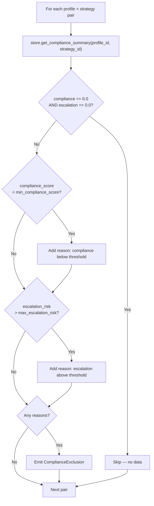

# Compliance

::: collection_swarm.analysis.compliance

The compliance module enforces safety thresholds on strategy–profile pairs. It identifies combinations where a strategy's regulatory compliance is too low or its escalation risk is too high, producing exclusion records that prevent unsafe strategies from being recommended.

---

## Data Model

### `ComplianceExclusion`

A frozen dataclass representing one excluded `(profile, strategy)` pair.

```python
@dataclass(frozen=True)
class ComplianceExclusion:
    profile_id: str
    strategy_id: str
    compliance_score: float
    escalation_risk: float
    reason: str
```

| Field | Type | Description |
|---|---|---|
| `profile_id` | `str` | The debtor profile this exclusion applies to |
| `strategy_id` | `str` | The collector strategy being excluded |
| `compliance_score` | `float` | The observed mean compliance score (0.0–1.0) |
| `escalation_risk` | `float` | The observed mean escalation risk (0.0–1.0) |
| `reason` | `str` | Human-readable explanation of which threshold(s) were violated |

!!! example "Reason String Format"
    Reasons are semicolon-delimited when both thresholds are violated:

    ```
    compliance_score 0.65 below 0.80; escalation_risk 0.42 above 0.30
    ```

---

## API

### `check_exclusions()`

```python
def check_exclusions(
    store: SimulationStore,
    profile_ids: list[str],
    strategy_ids: list[str],
    min_compliance_score: float = 0.8,
    max_escalation_risk: float = 0.3,
) -> list[ComplianceExclusion]
```

Check every `(profile, strategy)` pair against compliance thresholds and return a list of exclusions.

**Parameters**

| Parameter | Type | Default | Description |
|---|---|---|---|
| `store` | `SimulationStore` | — | Data store containing simulation results |
| `profile_ids` | `list[str]` | — | Profiles to check |
| `strategy_ids` | `list[str]` | — | Strategies to check |
| `min_compliance_score` | `float` | `0.8` | Minimum acceptable compliance score |
| `max_escalation_risk` | `float` | `0.3` | Maximum acceptable escalation risk |

**Returns**

A `list[ComplianceExclusion]` containing one entry for each pair that violates at least one threshold. Pairs with both scores at `0.0` (no data) are silently skipped.

---

## How Exclusion Checking Works



The function performs a **Cartesian product** check over `profile_ids × strategy_ids`:

1. For each pair, it queries the store for the compliance summary (mean compliance score and escalation risk).
2. Pairs with zero values for both metrics are skipped — this indicates no completed simulations exist.
3. Each non-zero pair is tested against both thresholds. Violations are collected into a semicolon-joined reason string.
4. If any violations exist, a `ComplianceExclusion` is appended to the result list.

---

## Per-Pair Exclusions

!!! important "Exclusions Are Context-Dependent"
    A strategy can be **excluded** for one profile but **recommended** for another. Compliance behavior varies by debtor archetype — an aggressive strategy might score well against a cooperative debtor but trigger escalation against a confrontational one.

    ```
    ┌──────────────────┬───────────────────────┬───────────────────────┐
    │                  │ cooperative_hardship   │ angry_disputer        │
    ├──────────────────┼───────────────────────┼───────────────────────┤
    │ firm_deadline    │ ✅ compliance=0.92     │ ❌ compliance=0.61    │
    │                  │    escalation=0.15     │    escalation=0.45    │
    ├──────────────────┼───────────────────────┼───────────────────────┤
    │ empathetic_plan  │ ✅ compliance=0.95     │ ✅ compliance=0.88    │
    │                  │    escalation=0.08     │    escalation=0.22    │
    └──────────────────┴───────────────────────┴───────────────────────┘
    ```

    In this example, `firm_deadline` is excluded for `angry_disputer` (both thresholds violated) but safe for `cooperative_hardship`.

---

## Default Thresholds

| Threshold | Default | Meaning |
|---|---|---|
| `min_compliance_score` | `0.8` | Strategies scoring below 80% compliance are flagged |
| `max_escalation_risk` | `0.3` | Strategies with escalation risk above 30% are flagged |

!!! tip "Adjusting Thresholds"
    Pass custom values to `check_exclusions()` to tighten or relax the safety bounds:

    ```python
    exclusions = check_exclusions(
        store,
        profile_ids=["cooperative_hardship", "angry_disputer"],
        strategy_ids=["firm_deadline", "empathetic_plan"],
        min_compliance_score=0.9,   # stricter
        max_escalation_risk=0.2,    # stricter
    )
    ```

---

## Downstream Usage

The exclusion list is consumed by:

- **[Playbook Generator](playbook.md)** — renders a compliance notice section listing every excluded pair with its scores.
- **[Arena](../advanced/arena.md)** — excluded pairs may be deprioritized or removed from future tournament rounds.
