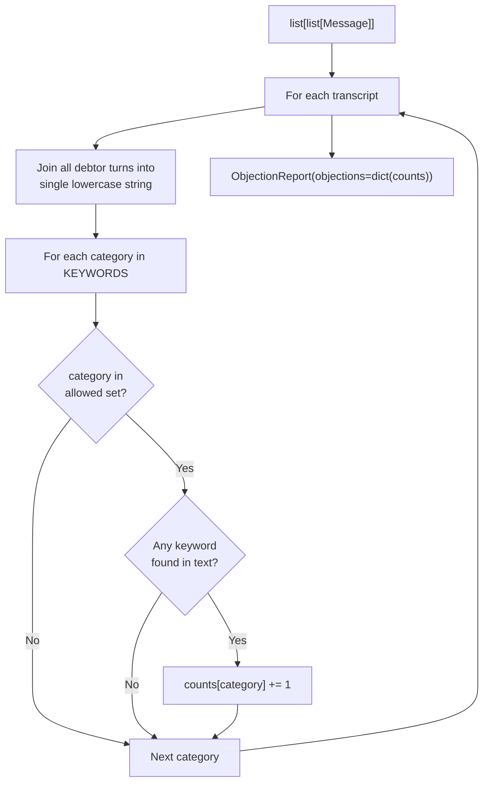

# Objections

::: collection_swarm.analysis.objections

The objections module extracts recurring debtor objection patterns from conversation transcripts using keyword matching. It produces a frequency report that feeds into the playbook and helps teams anticipate real-world debtor behavior.

---

## Data Model

### `ObjectionReport`

A Pydantic model mapping objection categories to the number of transcripts in which they appear.

```python
class ObjectionReport(BaseModel):
    objections: dict[str, int]
```

| Field | Type | Description |
|---|---|---|
| `objections` | `dict[str, int]` | Category name → count of transcripts containing at least one matching keyword |

!!! note "Counting Semantics"
    Each category is counted **once per transcript**, not once per keyword match. If a debtor says "I can't afford it, things are tough" in a single conversation, `inability_to_pay` increments by 1, not 2.

---

## Keyword Taxonomy

The module ships with a built-in `KEYWORDS` dictionary that maps five objection categories to their trigger phrases:

```python
KEYWORDS = {
    "inability_to_pay": ["can't afford", "cannot pay", "hardship", "tough spot"],
    "disputes_debt":    ["not mine", "dispute", "don't owe"],
    "wants_written_proof": ["written proof", "written validation", "validate"],
    "avoidance":        ["call back", "not now", "later"],
    "emotional_distress": ["tired", "angry", "stress"],
}
```

| Category | Keywords | Debtor Intent |
|---|---|---|
| `inability_to_pay` | `can't afford`, `cannot pay`, `hardship`, `tough spot` | Debtor acknowledges the debt but claims financial hardship |
| `disputes_debt` | `not mine`, `dispute`, `don't owe` | Debtor challenges the validity or ownership of the debt |
| `wants_written_proof` | `written proof`, `written validation`, `validate` | Debtor demands formal documentation before engaging |
| `avoidance` | `call back`, `not now`, `later` | Debtor deflects the conversation without committing |
| `emotional_distress` | `tired`, `angry`, `stress` | Debtor expresses emotional strain during the call |

---

## API

### `extract_objections()`

```python
def extract_objections(
    transcripts: list[list[Message]],
    taxonomy: list[str] | None = None,
) -> ObjectionReport
```

Scan debtor turns across multiple transcripts for keyword-based objection categories.

**Parameters**

| Parameter | Type | Default | Description |
|---|---|---|---|
| `transcripts` | `list[list[Message]]` | — | List of conversation transcripts, each a list of `Message` objects |
| `taxonomy` | `list[str] \| None` | `None` | Optional list of category names to restrict counting to. When `None`, all categories in `KEYWORDS` are considered |

**Returns**

An `ObjectionReport` with counts for each detected category.

**Example**

```python
from collection_swarm.analysis.objections import extract_objections

transcripts = store.get_all_transcripts("cooperative_hardship", "empathetic_plan")

report = extract_objections(transcripts)
for category, count in sorted(report.objections.items()):
    print(f"  {category}: {count} transcript(s)")
```

---

## How Extraction Works



1. For each transcript, all debtor messages are concatenated into a single lowercase string.
2. Each category in the `KEYWORDS` dictionary is checked against the allowed taxonomy set.
3. If **any** keyword for a category appears in the concatenated debtor text, that category's count increments by one for the transcript.
4. The final `Counter` is converted to a plain `dict` and wrapped in an `ObjectionReport`.

---

## Taxonomy Filtering

The optional `taxonomy` parameter restricts which categories are counted. This is useful when you only care about specific objection types:

```python
report = extract_objections(
    transcripts,
    taxonomy=["inability_to_pay", "disputes_debt"],
)
```

!!! info "Default Behavior"
    When `taxonomy` is `None`, the allowed set defaults to all keys in `KEYWORDS` — every category is counted.

!!! warning "Unknown Categories"
    If `taxonomy` contains a category name not present in `KEYWORDS`, it is silently ignored (no keywords to match against).

---

## Downstream Usage

The `ObjectionReport` is consumed by:

- **[Playbook Generator](playbook.md)** — renders an "Objection Playbook" subsection listing observed categories and their frequencies for each profile's recommended strategy.
