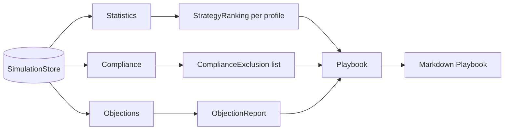

# Analysis Pipeline

The analysis pipeline transforms raw simulation data into actionable intelligence. It answers the question: *given every conversation the system has simulated, which strategies work best, which ones are unsafe, and what do debtors actually say?*

---

## Pipeline Architecture

The pipeline is composed of four modules, each with a single responsibility:

| Module | Entry point | Purpose |
|---|---|---|
| **Statistics** | `compare_strategies()` | Rank strategies per profile by mean payment probability |
| **Compliance** | `check_exclusions()` | Flag strategy–profile pairs that violate safety thresholds |
| **Objections** | `extract_objections()` | Scan debtor text for recurring objection categories |
| **Playbook** | `generate_playbook()` | Assemble a Markdown report from the other three modules |

## Data Flow

### 1. Store → Rankings

The `statistics` module queries the `SimulationStore` for every `(profile, strategy)` combination that has completed simulations. Results are grouped by `strategy_id` and sorted by `mean_payment_probability` in descending order, producing a `StrategyRanking` per profile.

### 2. Rankings → Exclusions

The `compliance` module iterates over every `(profile, strategy)` pair and checks two thresholds:

- **Minimum compliance score** — defaults to `0.8`
- **Maximum escalation risk** — defaults to `0.3`

Any pair that violates either threshold produces a `ComplianceExclusion` record with a human-readable `reason` string.

### 3. Exclusions → Objection Extraction

The `objections` module scans debtor dialogue from transcripts for keyword-based objection categories. It operates independently of rankings and exclusions but its output feeds into the playbook alongside them.

### 4. Everything → Playbook Generation

The `playbook` module consumes rankings, exclusions, and the store (for transcripts and objection data). It produces a single Markdown document that serves as a snapshot report.

---

## Design Principles

!!! info "Deterministic and Regenerable"
    Every module in the analysis pipeline is **deterministic** — given the same `SimulationStore` contents, the output is identical. There is no randomness, no LLM calls, and no external API dependencies.

!!! tip "Disposable Outputs"
    The playbook and all intermediate data structures are cheap to regenerate. Never treat them as primary data — the `SimulationStore` is the single source of truth.

!!! note "No Side Effects"
    Analysis functions are pure readers. They query the store but never write to it, making them safe to run at any time without affecting simulation state.

## Module Reference

| Page | Description |
|---|---|
| [Statistics & Rankings](statistics.md) | `StrategyRanking`, `StrategyStats`, and `compare_strategies()` |
| [Compliance](compliance.md) | `ComplianceExclusion` and `check_exclusions()` |
| [Objections](objections.md) | `ObjectionReport`, keyword taxonomy, and `extract_objections()` |
| [Playbook Generation](playbook.md) | `generate_playbook()` and the Markdown output structure |
