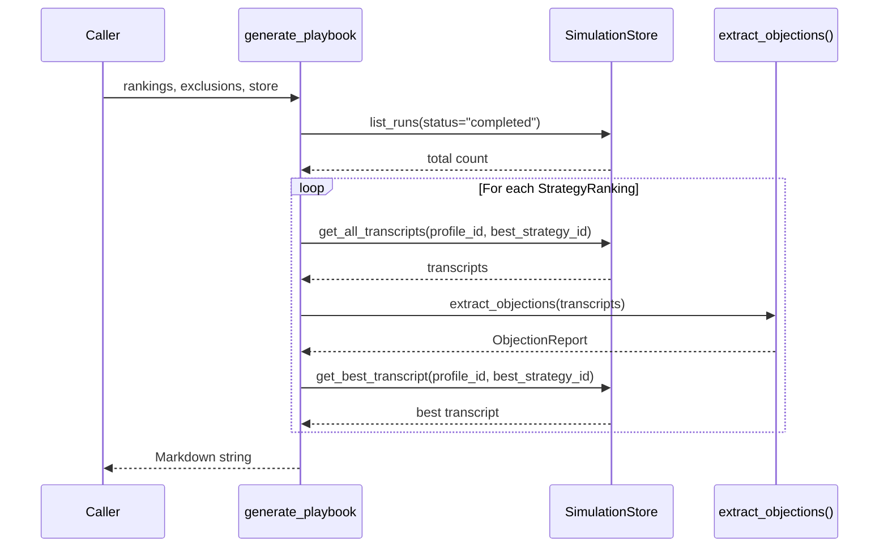

# Playbook Generation

::: collection_swarm.analysis.playbook

The playbook module assembles rankings, compliance exclusions, objection data, and example transcripts into a single Markdown document — a human-readable snapshot of what the simulation system has learned.

---

## API

### `generate_playbook()`

```python
def generate_playbook(
    rankings: list[StrategyRanking],
    exclusions: list[ComplianceExclusion],
    store: SimulationStore,
) -> str
```

Produce a complete Markdown playbook from analysis results.

**Parameters**

| Parameter | Type | Description |
|---|---|---|
| `rankings` | `list[StrategyRanking]` | Strategy rankings per profile (from the [statistics module](statistics.md)) |
| `exclusions` | `list[ComplianceExclusion]` | Compliance exclusions (from the [compliance module](compliance.md)) |
| `store` | `SimulationStore` | Data store for transcripts and objection extraction |

**Returns**

A `str` containing the complete Markdown document.

**Example**

```python
from collection_swarm.analysis.statistics import compare_strategies
from collection_swarm.analysis.compliance import check_exclusions
from collection_swarm.analysis.playbook import generate_playbook
from collection_swarm.store import SimulationStore

store = SimulationStore("output/simulations.db")

profile_ids = ["cooperative_hardship", "angry_disputer"]
strategy_ids = ["empathetic_plan", "firm_deadline"]

rankings = [compare_strategies(pid, store) for pid in profile_ids]
exclusions = check_exclusions(store, profile_ids, strategy_ids)

playbook_md = generate_playbook(rankings, exclusions, store)

with open("output/playbook.md", "w") as f:
    f.write(playbook_md)
```

---

## Playbook Structure

The generated Markdown document follows a fixed layout:

```
# Collection Playbook

Generated: 2026-05-03T10:30:00+00:00 | Simulations analyzed: 42

## Compliance Notice
- Exclude `firm_deadline` for `angry_disputer`: compliance=0.61, escalation_risk=0.45
- No compliance exclusions detected.  ← (when list is empty)

## Profile: cooperative_hardship
### Recommended Strategy: `empathetic_plan`
**Payment Probability:** 72%

### Strategy Ranking
| Strategy | Simulations | Payment Probability | Compliance | Escalation Risk |
|---|---:|---:|---:|---:|
| `empathetic_plan` | 10 | 72% | 95% | 8% |
| `firm_deadline` | 8 | 58% | 92% | 15% |

### Objection Playbook
- **inability_to_pay:** observed in 6 transcript(s).
- **wants_written_proof:** observed in 3 transcript(s).

### Example Transcript
> **Collector:** Hello, I'm calling about your medical balance...
> **Debtor:** I can't afford the full amount right now...
```

### Section Breakdown

| Section | Source | Content |
|---|---|---|
| **Title & Metadata** | `store.list_runs()` | Document title, UTC generation timestamp, total simulation count |
| **Compliance Notice** | `exclusions` parameter | Lists each excluded strategy–profile pair with scores, or "No compliance exclusions detected" |
| **Per-Profile Header** | `rankings` parameter | One `## Profile: {id}` section per ranking |
| **Recommended Strategy** | `StrategyRanking.strategies[0]` | Top-ranked strategy by payment probability |
| **Strategy Ranking Table** | `StrategyRanking.strategies` | All strategies with simulation count and three metric columns |
| **Objection Playbook** | `extract_objections()` | Categories observed in transcripts for the recommended strategy |
| **Example Transcript** | `store.get_best_transcript()` | The highest-scoring transcript for the recommended strategy |

---

## Internal Data Flow



---

## Design Notes

!!! tip "Snapshot Report"
    The playbook is a **snapshot** — a disposable, point-in-time document. It can be regenerated from the `SimulationStore` at any time. Never treat the playbook as primary data; the store is the source of truth.

!!! info "No Empty Profiles"
    When a profile has no completed simulations, the playbook prints "No completed simulations." and skips the ranking table, objection playbook, and example transcript sections.

!!! note "Objection Scope"
    Objections are extracted only for the **recommended** (top-ranked) strategy for each profile, not for every strategy. This keeps the playbook focused on actionable insights.

---

## Output Conventions

- All percentages are formatted with `:.0%` (e.g., `72%`, not `0.72`).
- Compliance exclusion scores use `:.2f` precision (e.g., `0.65`).
- Transcript turns are rendered as Markdown blockquotes with bolded role names: `> **Collector:** ...`.
- The generation timestamp is always in UTC ISO 8601 format.
