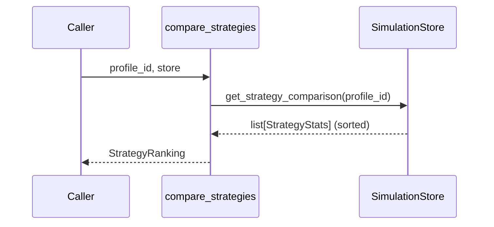

# Statistics & Rankings

::: collection_swarm.analysis.statistics

The statistics module provides deterministic strategy ranking for each debtor profile. It queries the `SimulationStore` and returns strategies sorted by effectiveness.

---

## Data Model

### `StrategyStats`

Aggregated metrics for one `(profile, strategy)` pair, returned from the store's `get_strategy_comparison()` method.

```python
class StrategyStats(BaseModel):
    profile_id: str
    strategy_id: str
    simulation_count: int
    mean_payment_probability: float
    mean_compliance_score: float
    mean_escalation_risk: float
```

| Field | Type | Description |
|---|---|---|
| `profile_id` | `str` | The debtor profile these stats apply to |
| `strategy_id` | `str` | The collector strategy being measured |
| `simulation_count` | `int` | Number of completed simulations for this pair |
| `mean_payment_probability` | `float` | Average payment probability across simulations (0.0–1.0) |
| `mean_compliance_score` | `float` | Average regulatory compliance score (0.0–1.0) |
| `mean_escalation_risk` | `float` | Average risk of debtor escalation (0.0–1.0) |

### `StrategyRanking`

A frozen dataclass that groups the ranked list of strategies for a single profile.

```python
@dataclass(frozen=True)
class StrategyRanking:
    profile_id: str
    strategies: list[StrategyStats]

    @property
    def recommended_strategy_id(self) -> str | None:
        return self.strategies[0].strategy_id if self.strategies else None
```

| Field / Property | Type | Description |
|---|---|---|
| `profile_id` | `str` | The profile being ranked |
| `strategies` | `list[StrategyStats]` | Strategies sorted by `mean_payment_probability` descending |
| `recommended_strategy_id` | `str \| None` | Convenience property — the `strategy_id` of the top-ranked strategy, or `None` if no simulations exist |

!!! info "Immutability"
    `StrategyRanking` is a frozen dataclass. Once created, its fields cannot be reassigned. This makes rankings safe to pass across modules without defensive copies.

---

## API

### `compare_strategies()`

```python
def compare_strategies(
    profile_id: str,
    store: SimulationStore,
) -> StrategyRanking
```

Rank all strategies that have been simulated against a given profile.

**Parameters**

| Parameter | Type | Description |
|---|---|---|
| `profile_id` | `str` | The debtor profile to rank strategies for |
| `store` | `SimulationStore` | Data store containing completed simulation results |

**Returns**

A `StrategyRanking` whose `strategies` list is sorted by `mean_payment_probability` in descending order. The sorting and grouping are performed inside `SimulationStore.get_strategy_comparison()`.

**Example**

```python
from collection_swarm.analysis.statistics import compare_strategies
from collection_swarm.store import SimulationStore

store = SimulationStore("output/simulations.db")
ranking = compare_strategies("cooperative_hardship", store)

print(f"Best strategy: {ranking.recommended_strategy_id}")
for stat in ranking.strategies:
    print(
        f"  {stat.strategy_id}: "
        f"payment={stat.mean_payment_probability:.0%}, "
        f"compliance={stat.mean_compliance_score:.0%}, "
        f"escalation={stat.mean_escalation_risk:.0%} "
        f"({stat.simulation_count} sims)"
    )
```

---

## How Ranking Works



1. The caller provides a `profile_id` and a `SimulationStore` reference.
2. `compare_strategies()` delegates to `store.get_strategy_comparison(profile_id)`.
3. The store groups all completed simulation runs by `strategy_id`, computes the mean of `payment_probability`, `compliance_score`, and `escalation_risk`, and returns the results sorted by `mean_payment_probability` descending.
4. The sorted list is wrapped in a `StrategyRanking` and returned.

!!! warning "Empty Results"
    If no simulations exist for a profile, `strategies` will be an empty list and `recommended_strategy_id` will return `None`. Downstream consumers (e.g., the playbook generator) handle this gracefully by printing "No completed simulations."

---

## Downstream Usage

The `StrategyRanking` objects produced here are consumed by:

- **[Playbook Generator](playbook.md)** — renders per-profile sections with the recommended strategy and a ranking table.
- **[Arena](../advanced/arena.md)** — uses ranking data alongside Elo ratings for tournament scheduling decisions.
