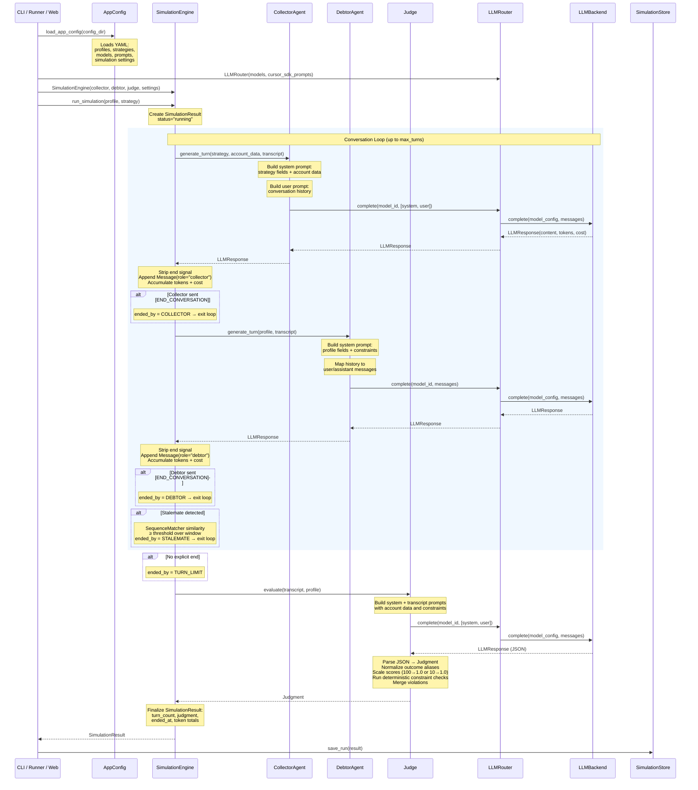
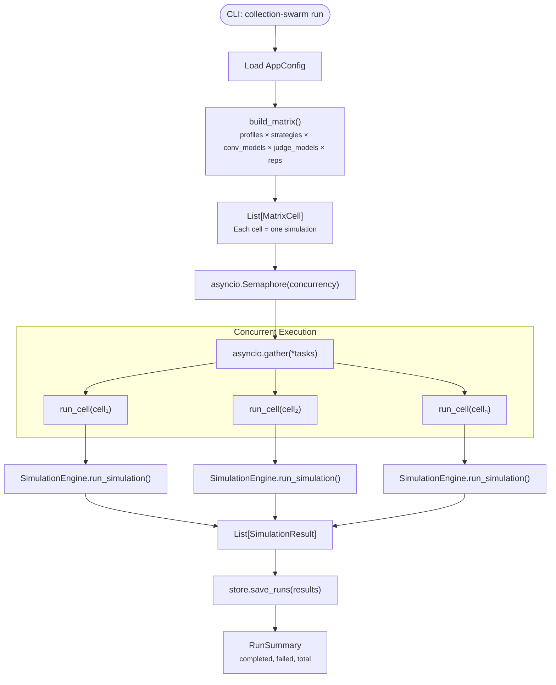
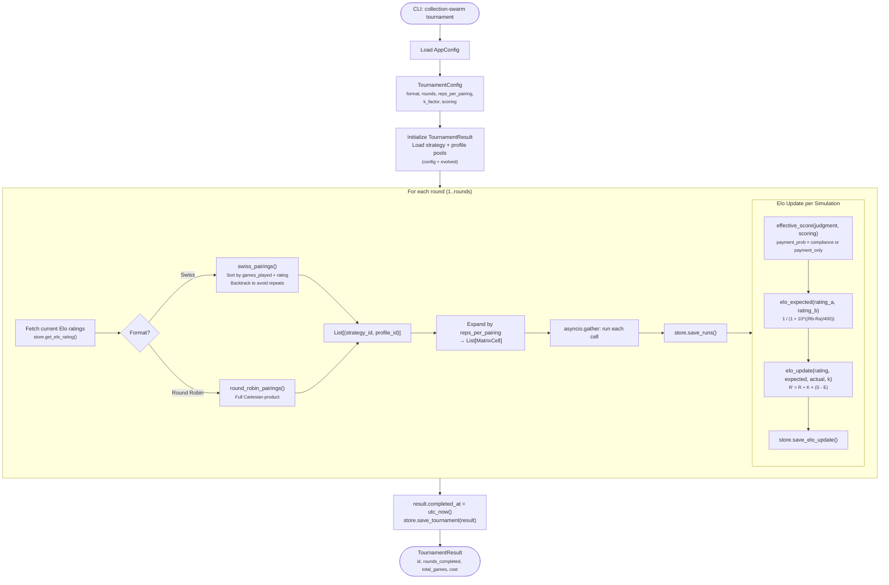
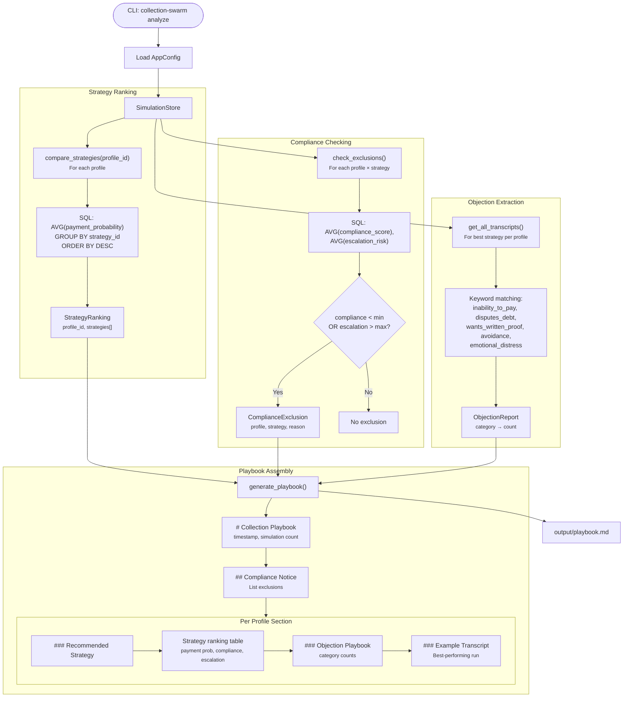
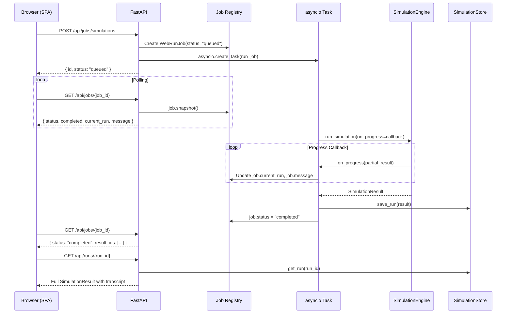
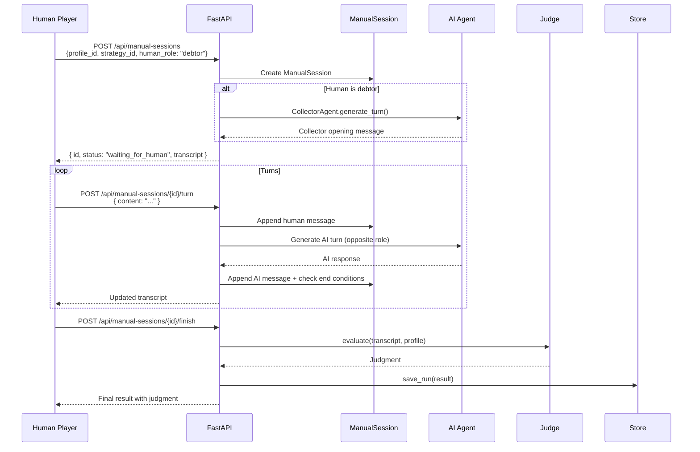

# Data Flow

This document traces data through every major workflow in Collection Swarm — from a single simulation through batch matrix runs, competitive tournaments, evolutionary cycles, and the analysis pipeline.

---

## Single Simulation Lifecycle

A single simulation is the atomic unit of the system. Every higher-level workflow (matrix, tournament, evolution) ultimately calls `SimulationEngine.run_simulation()`.



### End Conditions

The conversation loop terminates under four conditions:

| Condition | `ended_by` Value | Detection |
|---|---|---|
| Collector includes `[END_CONVERSATION]` | `collector` | String search in response content |
| Debtor includes `[END_CONVERSATION]` | `debtor` | String search in response content |
| Consecutive turns are too similar | `stalemate` | `SequenceMatcher.ratio() ≥ threshold` over a sliding window of pair-wise turns |
| Turn count reaches `max_turns` | `turn_limit` | Simple counter check |

### Token & Cost Tracking

Every `LLMResponse` carries `input_tokens`, `output_tokens`, and `estimated_cost_usd`. The engine accumulates these across all collector turns, debtor turns, and the judge evaluation into `SimulationResult.total_input_tokens`, `total_output_tokens`, and `estimated_cost_usd`.

---

## Batch / Matrix Run Flow

The matrix run executes the **Cartesian product** of selected profiles, strategies, conversation models, and judge models — optionally repeated.



### MatrixCell

Each `MatrixCell` is a frozen, hashable tuple of:

```
(profile_id, strategy_id, conversation_model, judge_model)
```

This makes cells suitable as dictionary keys for coverage tracking and backfill detection.

!!! info "Backfill Support"
    The store provides `get_backfill_needed(target_reps, cells)` to identify matrix cells that have fewer completed runs than the target repetition count, enabling incremental matrix completion.

---

## Tournament Flow

Tournaments use **Elo ratings** to competitively rank strategies against profiles over multiple rounds.



### Swiss Pairing Algorithm

Swiss pairings prevent repeat matchups and balance play:

1. **Sort strategies** by `(games_played ascending, rating descending)` — under-played strategies get priority.
2. **Sort profiles** with a bye priority — profiles with zero games are matched first.
3. **Backtracking search** attempts to find a perfect assignment where no `(strategy, profile)` pair repeats from `history`.
4. **Fallback**: if no repeat-free assignment exists, greedy matching selects the best available profile per strategy.

### Elo Rating System

| Parameter | Default | Purpose |
|---|---|---|
| `k_factor_initial` | 32.0 | Rating volatility for entities with < `threshold` games |
| `k_factor_stable` | 16.0 | Rating volatility for established entities |
| `k_factor_threshold` | 30 | Games played before switching to stable K |
| `scoring` | `payment_x_compliance` | Score formula: `payment_probability × compliance_score` |

Strategies **win** when their effective score > 0.55 (above the draw threshold). Profiles win when strategies score below 0.45.

---

## Evolution Cycle Flow

The evolution cycle alternates between **tournament evaluation** and **LLM-driven strategy mutation**, with optional **profile hardening**.

```mermaid
flowchart TB
    START(["CLI: collection-swarm evolve"]) --> CONFIG["Load AppConfig + EvolutionConfig"]
    CONFIG --> INIT["Initialize active_strategy_ids<br/>Initialize active_profile_ids"]

    INIT --> GEN_LOOP

    subgraph GEN_LOOP["For each generation (1..generations)"]
        TOURNAMENT["run_tournament()<br/><small>Evaluate current population</small>"]
        TOURNAMENT --> RANK["Sort strategies by Elo rating"]

        RANK --> SELECT_TOP["Select top_k strategies<br/><small>Best performers</small>"]
        RANK --> SELECT_BOTTOM["Select bottom_k strategies<br/><small>Worst performers</small>"]

        SELECT_TOP --> TRANSCRIPTS["Load failure transcripts<br/><small>From bottom strategy runs</small>"]
        SELECT_BOTTOM --> TRANSCRIPTS

        TRANSCRIPTS --> EVOLVE["evolve_strategies()<br/><small>LLM generates improved YAML</small>"]

        EVOLVE --> PARSE["Parse YAML → Strategy objects<br/><small>Fallback: clone top strategy</small>"]

        PARSE --> SAVE_EVOLVED["store.save_evolved_strategy()<br/><small>With StrategyLineage</small>"]
        SAVE_EVOLVED --> UPDATE_POOL["Add evolved IDs to<br/>active_strategy_ids"]

        UPDATE_POOL --> CULL_CHECK{cull_bottom_n > 0?}
        CULL_CHECK -->|Yes| CULL["cull_strategies()<br/><small>Keep seeds + top evolved<br/>up to population_size</small>"]
        CULL --> REMOVE["store.cull_evolved_strategy()<br/><small>Set culled_at timestamp</small>"]
        CULL_CHECK -->|No| HARDEN_CHECK

        REMOVE --> HARDEN_CHECK{hardening enabled?}
        HARDEN_CHECK -->|Yes| HARDEN["harden_profiles()<br/><small>LLM generates harder variants</small>"]
        HARDEN --> SAVE_PROFILES["store.save_evolved_profile()<br/><small>With ProfileLineage</small>"]
        SAVE_PROFILES --> ADD_PROFILES["Add hardened IDs to<br/>active_profile_ids"]
        HARDEN_CHECK -->|No| NEXT_GEN
        ADD_PROFILES --> NEXT_GEN["Next generation"]
    end

    GEN_LOOP --> DONE(["List[TournamentResult]<br/><small>One per generation</small>"])
```



### Strategy Evolution

The evolver LLM receives:

- **Top strategies** — high Elo performers (YAML dump)
- **Bottom strategies** — low Elo performers (YAML dump)
- **Failure transcripts** — up to 5 transcripts from bottom-strategy runs

It produces new strategies as YAML under a `strategies:` key. Each evolved strategy gets:

- A unique `evo_{gen}_mutate_{hash}` ID
- A `StrategyLineage` record tracking parent IDs, generation, and mutation type

!!! note "Fallback"
    If the LLM fails to produce valid YAML, the system clones the top strategy as a deterministic fallback mutation.

### Strategy Culling

The `cull_strategies()` function preserves:

1. **All seed strategies** — original config-defined strategies are never culled.
2. **Top evolved strategies** — sorted by Elo rating, kept up to `population_size - len(seeds)`.

Culled strategies receive a `culled_at` timestamp and are excluded from future tournament pools.

### Profile Hardening

When enabled, the hardener LLM creates more challenging debtor profiles:

- Input: easy profiles (from bottom-k in Elo) + winning transcripts
- Output: harder profile variants with tighter constraints
- Fallback: adds an official-channel-request constraint to the parent profile

---

## Analysis Pipeline Flow

The analysis pipeline runs after simulations are complete and produces the **Collection Playbook**.



### Data Flow Summary

| Stage | Input | Output | Storage |
|---|---|---|---|
| **Simulation** | Profile + Strategy + Models | SimulationResult | `runs` table |
| **Tournament** | SimulationResults + Elo state | TournamentResult + Elo updates | `tournaments`, `elo_ratings`, `elo_history` |
| **Evolution** | Tournament Elo rankings | New Strategy variants | `evolved_strategies` |
| **Hardening** | Easy profiles + transcripts | Harder Profile variants | `evolved_profiles` |
| **Statistics** | Completed runs | StrategyRanking per profile | In-memory |
| **Compliance** | Completed runs + thresholds | ComplianceExclusion list | In-memory |
| **Objections** | Transcript text | ObjectionReport | In-memory |
| **Playbook** | Rankings + Exclusions + Objections | Markdown document | `output/playbook.md` |

---

## Web Dashboard Data Flow

The web dashboard mirrors all CLI workflows via REST APIs with real-time progress tracking.



### Job Types

| Job Kind | Trigger Endpoint | Behavior |
|---|---|---|
| `single` | `POST /api/jobs/simulations` | One simulation with progress streaming |
| `matrix` | `POST /api/jobs/matrix` | Parallel matrix with per-cell progress |
| `tournament` | `POST /api/jobs/tournaments` | Multi-round tournament with Elo updates |
| `model_benchmark` | `POST /api/jobs/model-benchmarks` | Cursor SDK model evaluation probes |
| `calibration` | `POST /api/jobs/calibration` | Judge calibration against human labels |

### Manual Role-Play Sessions

Manual sessions allow a human to play either the collector or debtor role:



!!! tip "Concurrent Safety"
    Each manual session uses an `asyncio.Lock` to prevent race conditions from rapid turn submissions.
