# Domain Model

All domain models are defined as [Pydantic](https://docs.pydantic.dev/) `BaseModel` classes in `collection_swarm.models`. This document provides a complete reference for every model, enum, and their relationships.

---

## Class Diagram

```mermaid
classDiagram
    direction TB

    class Profile {
        +str id
        +str archetype
        +str financial_situation
        +float debt_amount
        +int debt_age_days
        +str debt_type
        +int prior_contact_count
        +str emotional_state
        +str primary_objection
        +str responsiveness
        +str demographics
        +str backstory
        +list~Constraint~ constraints
        +account_data() AccountData
    }

    class Constraint {
        +str text
        +ConstraintRule|None rule
    }

    class ConstraintRule {
        +Literal type
        +float|None amount
        +str|None frequency
        +str|None action
        +validate_required_fields()
    }

    class AccountData {
        +float debt_amount
        +int debt_age_days
        +str debt_type
        +int prior_contact_count
    }

    class Strategy {
        +str id
        +str tone
        +str opening_approach
        +str negotiation_tactic
        +str escalation_style
        +str concession_willingness
        +str compliance_adherence
        +str follow_up_strategy
        +str|None payment_channel
        +str|None primary_anchor
        +str|None discovery_questions
        +str|None framing
        +str|None discount_authority
        +str|None liquidation_disclosure
        +str|None cultural_register
        +str|None rationale
    }

    class Message {
        +Literal role
        +str content
    }

    class Judgment {
        +str reasoning
        +PaymentOutcome payment_outcome
        +float payment_probability
        +float debtor_satisfaction
        +float compliance_score
        +int conversation_efficiency
        +float rapport_built
        +float escalation_risk
        +str end_reason
        +list~str~ constraint_violations
    }

    class SimulationResult {
        +str id
        +Literal status
        +str|None error_message
        +str profile_id
        +str strategy_id
        +str conversation_model
        +str judge_model
        +datetime started_at
        +datetime|None ended_at
        +int turn_count
        +EndedBy|None ended_by
        +list~Message~ transcript
        +Judgment|None judgment
        +int total_input_tokens
        +int total_output_tokens
        +float estimated_cost_usd
    }

    class PaymentOutcome {
        <<enumeration>>
        FULL_PAYMENT
        PARTIAL_PAYMENT
        PAYMENT_PLAN
        PROMISE_TO_PAY
        NO_COMMITMENT
        REFUSAL
        HANG_UP
    }

    class EndedBy {
        <<enumeration>>
        COLLECTOR
        DEBTOR
        STALEMATE
        TURN_LIMIT
    }

    class MatrixCell {
        +str profile_id
        +str strategy_id
        +str conversation_model
        +str judge_model
    }

    class EloRating {
        +Literal entity_type
        +str entity_id
        +str conversation_model
        +str judge_model
        +float rating
        +int games_played
        +int wins
        +int losses
        +int draws
    }

    class EloUpdate {
        +Literal entity_type
        +str entity_id
        +str opponent_id
        +str conversation_model
        +str judge_model
        +str simulation_id
        +float rating_before
        +float rating_after
        +float effective_score
        +float expected_score
        +datetime timestamp
    }

    class TournamentConfig {
        +Literal format
        +int rounds
        +int reps_per_pairing
        +float k_factor_initial
        +float k_factor_stable
        +int k_factor_threshold
        +Literal scoring
    }

    class TournamentResult {
        +str id
        +TournamentConfig config
        +int rounds_completed
        +int total_games
        +datetime started_at
        +datetime|None completed_at
        +float total_cost_usd
    }

    class EvolutionConfig {
        +int population_size
        +int top_k
        +int bottom_k
        +int cull_bottom_n
        +float mutation_rate
        +float crossover_rate
        +str|None evolver_model_id
    }

    class StrategyLineage {
        +str strategy_id
        +list~str~ parent_ids
        +int generation
        +str mutation_type
        +str mutation_description
        +datetime created_at
        +datetime|None culled_at
    }

    class ProfileLineage {
        +str profile_id
        +str|None parent_id
        +int generation
        +str hardening_type
        +str hardening_description
        +datetime created_at
        +datetime|None culled_at
    }

    class HardeningConfig {
        +bool enabled
        +str|None hardener_model_id
        +float max_drift
        +bool realism_check
    }

    class StrategyStats {
        +str profile_id
        +str strategy_id
        +int simulation_count
        +float mean_payment_probability
        +float mean_compliance_score
        +float mean_escalation_risk
    }

    class PromptConfig {
        +CollectorPromptConfig collector
        +DebtorPromptConfig debtor
        +JudgePromptConfig judge
        +CursorSdkPromptConfig cursor_sdk
    }

    class ModelConfig {
        +str id
        +str backend
        +str provider
        +float input_cost_per_m
        +float output_cost_per_m
        +str|None model_name
        +litellm_model() str
    }

    class SimulationSettings {
        +ConversationSettings conversation
        +int default_repetitions
        +float min_compliance_score
        +float max_escalation_risk
        +list~str~ objection_taxonomy
        +ArenaSettings arena
    }

    class ConversationSettings {
        +int max_turns
        +str end_signal
        +int stalemate_window
        +float stalemate_similarity_threshold
    }

    class ArenaSettings {
        +Literal default_format
        +int default_rounds
        +float k_factor_initial
        +float k_factor_stable
        +int k_factor_threshold
        +Literal scoring
    }

    Profile "1" *-- "*" Constraint
    Constraint "1" o-- "0..1" ConstraintRule
    Profile ..> AccountData : account_data property

    SimulationResult "*" o-- "1" Judgment
    SimulationResult "*" *-- "*" Message
    SimulationResult --> PaymentOutcome
    SimulationResult --> EndedBy
    Judgment --> PaymentOutcome

    TournamentResult "1" *-- "1" TournamentConfig
    EloUpdate --> EloRating : updates

    StrategyLineage --> Strategy : tracks
    ProfileLineage --> Profile : tracks

    SimulationSettings "1" *-- "1" ConversationSettings
    SimulationSettings "1" *-- "1" ArenaSettings

    PromptConfig *-- CollectorPromptConfig
    PromptConfig *-- DebtorPromptConfig
    PromptConfig *-- JudgePromptConfig
    PromptConfig *-- CursorSdkPromptConfig

    class CollectorPromptConfig {
        +str system
        +str history_empty
        +str history
    }

    class DebtorPromptConfig {
        +str system
        +str constraints_empty
        +str history_message
    }

    class JudgePromptConfig {
        +str system
        +str transcript
    }

    class CursorSdkPromptConfig {
        +str preamble
    }
```



---

## Enumerations

### PaymentOutcome

The `PaymentOutcome` enum classifies the result of a collection conversation. It extends `StrEnum` for direct string serialization.

| Value | Description |
|---|---|
| `full_payment` | Debtor agreed to pay the full outstanding amount |
| `partial_payment` | Debtor agreed to pay a portion of the debt |
| `payment_plan` | Debtor agreed to a structured installment plan |
| `promise_to_pay` | Debtor verbally committed to pay at a future date |
| `no_commitment` | Conversation ended without any payment commitment |
| `refusal` | Debtor explicitly refused to pay |
| `hang_up` | Debtor terminated the conversation abruptly |

```python
class PaymentOutcome(StrEnum):
    FULL_PAYMENT = "full_payment"
    PARTIAL_PAYMENT = "partial_payment"
    PAYMENT_PLAN = "payment_plan"
    PROMISE_TO_PAY = "promise_to_pay"
    NO_COMMITMENT = "no_commitment"
    REFUSAL = "refusal"
    HANG_UP = "hang_up"
```

!!! info "Outcome Normalization"
    The judge parser normalizes a wide range of LLM-generated outcome strings into these canonical values. Aliases like `"payment_plan_agreed"`, `"promised"`, `"pending_verification"`, `"hangup"`, and others are mapped automatically.

### EndedBy

The `EndedBy` enum records which party or condition terminated the conversation.

| Value | Trigger |
|---|---|
| `collector` | Collector included `[END_CONVERSATION]` in a response |
| `debtor` | Debtor included `[END_CONVERSATION]` in a response |
| `stalemate` | Consecutive turns exceeded the similarity threshold |
| `turn_limit` | Conversation reached `max_turns` without resolution |

```python
class EndedBy(StrEnum):
    COLLECTOR = "collector"
    DEBTOR = "debtor"
    STALEMATE = "stalemate"
    TURN_LIMIT = "turn_limit"
```

---

## Simulation Domain Models

### Profile

Represents a debtor persona with demographic, financial, and behavioral attributes.

| Field | Type | Constraints | Description |
|---|---|---|---|
| `id` | `str` | required | Unique identifier (e.g., `cooperative_hardship`) |
| `archetype` | `str` | required | Behavioral archetype (e.g., `"Cooperative but cash-strapped"`) |
| `financial_situation` | `str` | required | Free-text description of financial circumstances |
| `debt_amount` | `float` | `> 0` | Outstanding debt in currency units |
| `debt_age_days` | `int` | `≥ 0` | Days since the debt was incurred |
| `debt_type` | `str` | required | Category of debt (e.g., `"credit_card"`, `"personal_loan"`) |
| `prior_contact_count` | `int` | `≥ 0` | Number of previous collection attempts |
| `emotional_state` | `str` | required | Current emotional disposition (e.g., `"anxious"`, `"hostile"`) |
| `primary_objection` | `str` | required | Main reason for resistance (e.g., `"inability_to_pay"`) |
| `responsiveness` | `str` | required | Communication willingness level (e.g., `"high"`, `"low"`) |
| `demographics` | `str` | required | Demographic description |
| `backstory` | `str` | required | Narrative context for the debtor's situation |
| `constraints` | `list[Constraint]` | default `[]` | Behavioral invariants the debtor must follow |

The `account_data` property extracts an `AccountData` view with just the financial fields, used by the collector agent's prompt.

### Constraint

Pairs a human-readable constraint description with an optional machine-readable rule.

| Field | Type | Description |
|---|---|---|
| `text` | `str` | Natural language constraint (e.g., `"Will not pay more than R$ 150/month"`) |
| `rule` | `ConstraintRule \| None` | Optional structured rule for deterministic verification |

### ConstraintRule

Machine-readable invariant verified deterministically by the judge after LLM evaluation.

| Field | Type | Required When | Description |
|---|---|---|---|
| `type` | `Literal["max_payment", "required_action"]` | always | Rule category |
| `amount` | `float \| None` | `type == "max_payment"` | Maximum acceptable payment amount |
| `frequency` | `str \| None` | optional | Payment frequency (e.g., `"monthly"`) |
| `action` | `str \| None` | `type == "required_action"` | Action identifier |

**Supported `action` values for `required_action` type:**

| Action | Description |
|---|---|
| `demand_written_proof` | Debtor must mention written proof / fatura detalhada / contrato before discussing payment |
| `cite_liquidator_and_official_channel` | Collector must reference the liquidator or an official channel before requesting payment |
| `provide_official_boleto_path` | Collector must mention an official boleto or validation channel |
| `verify_official_channel` | Collector must disclose an official validation or payment channel |

!!! warning "Validation"
    A `model_validator` enforces that `max_payment` rules include `amount` and `required_action` rules include `action`. Invalid rules raise `ValueError` at construction time.

### AccountData

A read-only view of the financial subset of a `Profile`, passed to the collector agent.

| Field | Type | Constraints | Description |
|---|---|---|---|
| `debt_amount` | `float` | `> 0` | Outstanding debt |
| `debt_age_days` | `int` | `≥ 0` | Debt age in days |
| `debt_type` | `str` | required | Debt category |
| `prior_contact_count` | `int` | `≥ 0` | Previous contact attempts |

---

### Strategy

Defines the behavioral configuration for the collector agent.

#### Core Fields (Required)

| Field | Type | Description |
|---|---|---|
| `id` | `str` | Unique identifier (e.g., `empathetic_payment_plan`) |
| `tone` | `str` | Communication style (e.g., `"empathetic"`, `"firm"`, `"neutral"`) |
| `opening_approach` | `str` | How the collector opens the conversation |
| `negotiation_tactic` | `str` | Primary negotiation method (e.g., `"payment_plan"`, `"settlement_offer"`) |
| `escalation_style` | `str` | Approach when debtor resists (e.g., `"gentle_reminder"`, `"consequences"`) |
| `concession_willingness` | `str` | Flexibility on terms (e.g., `"high"`, `"moderate"`, `"low"`) |
| `compliance_adherence` | `str` | How strictly the collector follows regulatory rules |
| `follow_up_strategy` | `str` | Post-conversation follow-up plan |

#### Will Bank / Brazilian Context Fields (Optional)

These fields provide deeper behavioral control for the Will Bank liquidation context:

| Field | Type | Description |
|---|---|---|
| `payment_channel` | `str \| None` | Preferred payment method (e.g., `"boleto_registrado"`) |
| `primary_anchor` | `str \| None` | Initial price anchor strategy |
| `discovery_questions` | `str \| None` | Questions to understand the debtor's situation |
| `framing` | `str \| None` | How the debt is framed to the debtor |
| `discount_authority` | `str \| None` | Discount limits the collector can offer |
| `liquidation_disclosure` | `str \| None` | How the bank liquidation context is disclosed |
| `cultural_register` | `str \| None` | Language register (formal/informal/regional) |
| `rationale` | `str \| None` | Design rationale for the strategy |

!!! note "Backward Compatibility"
    The `Strategy` model uses `ConfigDict(extra="ignore")`, so legacy strategies without optional fields continue to work. Optional fields are surfaced to the LLM prompt and analysis when present.

---

### Message

A single turn in a conversation transcript.

| Field | Type | Allowed Values | Description |
|---|---|---|---|
| `role` | `Literal` | `"collector"`, `"debtor"`, `"system"`, `"judge"` | Speaker identity |
| `content` | `str` | any | Message text |

!!! tip "LLMMessage vs Message"
    `Message` uses domain roles (`collector`, `debtor`). The internal `LLMMessage` model uses LLM-standard roles (`system`, `user`, `assistant`). Agents handle the translation between these two representations.

---

### Judgment

The structured evaluation produced by the judge after analyzing a transcript.

| Field | Type | Range | Default | Description |
|---|---|---|---|---|
| `reasoning` | `str` | — | required | Free-text justification of the scores |
| `payment_outcome` | `PaymentOutcome` | enum | `no_commitment` | Classified conversation outcome |
| `payment_probability` | `float` | `[0.0, 1.0]` | required | Likelihood the debtor will actually pay |
| `debtor_satisfaction` | `float` | `[0.0, 1.0]` | required | How satisfied the debtor felt |
| `compliance_score` | `float` | `[0.0, 1.0]` | required | Regulatory compliance of the collector |
| `conversation_efficiency` | `int` | `≥ 0` | required | Overwritten to `turn_count` by the parser |
| `rapport_built` | `float` | `[0.0, 1.0]` | required | Quality of relationship established |
| `escalation_risk` | `float` | `[0.0, 1.0]` | required | Risk of debtor escalating (complaint, legal) |
| `end_reason` | `str` | — | `"no_resolution"` | Why the conversation ended |
| `constraint_violations` | `list[str]` | — | `[]` | Descriptions of violated constraints |

!!! info "Score Normalization"
    The judge parser auto-detects whether scores are on a 0–1, 0–10, or 0–100 scale and normalizes to 0–1. If any score field exceeds 10, all are divided by 100; if any exceeds 1 (but ≤ 10), all are divided by 10.

---

### SimulationResult

The complete record of a single simulation run.

| Field | Type | Default | Description |
|---|---|---|---|
| `id` | `str` | `sim_{uuid12}` | Auto-generated unique identifier |
| `status` | `Literal` | `"completed"` | `"completed"`, `"failed"`, or `"running"` |
| `error_message` | `str \| None` | `None` | Error description if status is `"failed"` |
| `profile_id` | `str` | required | Reference to the debtor profile used |
| `strategy_id` | `str` | required | Reference to the collector strategy used |
| `conversation_model` | `str` | required | Model ID used for collector and debtor |
| `judge_model` | `str` | required | Model ID used for judgment |
| `started_at` | `datetime` | `utc_now()` | Simulation start timestamp (UTC) |
| `ended_at` | `datetime \| None` | `None` | Simulation end timestamp (UTC) |
| `turn_count` | `int` | `0` | Total messages in transcript |
| `ended_by` | `EndedBy \| None` | `None` | What terminated the conversation |
| `transcript` | `list[Message]` | `[]` | Full conversation history |
| `judgment` | `Judgment \| None` | `None` | Judge evaluation (null if failed before judging) |
| `total_input_tokens` | `int` | `0` | Cumulative input tokens across all LLM calls |
| `total_output_tokens` | `int` | `0` | Cumulative output tokens across all LLM calls |
| `estimated_cost_usd` | `float` | `0.0` | Estimated total cost in USD |

!!! note "Datetime Handling"
    Custom validators parse ISO-format strings and ensure all datetimes carry UTC timezone info. The model uses `ConfigDict(use_enum_values=True)` for clean serialization.

---

## Arena & Tournament Models

### MatrixCell

An immutable, hashable identifier for a single simulation configuration. Used as dictionary keys for coverage tracking.

| Field | Type | Description |
|---|---|---|
| `profile_id` | `str` | Debtor profile |
| `strategy_id` | `str` | Collector strategy |
| `conversation_model` | `str` | Model for collector/debtor |
| `judge_model` | `str` | Model for judge |

```python
class MatrixCell(BaseModel, frozen=True):
    ...
```

### EloRating

The current Elo state for an entity (strategy or profile) within a specific model pair context.

| Field | Type | Default | Description |
|---|---|---|---|
| `entity_type` | `Literal["strategy", "profile"]` | required | Whether this rates a strategy or profile |
| `entity_id` | `str` | required | ID of the rated entity |
| `conversation_model` | `str` | `""` | Model context (empty = global) |
| `judge_model` | `str` | `""` | Judge context (empty = global) |
| `rating` | `float` | `1500.0` | Current Elo rating |
| `games_played` | `int` | `0` | Total completed games |
| `wins` | `int` | `0` | Games won (score > 0.55) |
| `losses` | `int` | `0` | Games lost (score < 0.45) |
| `draws` | `int` | `0` | Games drawn (0.45 ≤ score ≤ 0.55) |

!!! info "Draw Threshold"
    The global constant `DRAW_THRESHOLD = 0.05` defines the band around 0.5 where outcomes are classified as draws. A strategy "wins" if its effective score exceeds `0.5 + 0.05 = 0.55`.

### EloUpdate

A single Elo rating change event, stored in the `elo_history` table.

| Field | Type | Description |
|---|---|---|
| `entity_type` | `Literal["strategy", "profile"]` | Entity being rated |
| `entity_id` | `str` | Entity ID |
| `opponent_id` | `str` | Opposing entity ID |
| `conversation_model` | `str` | Model context |
| `judge_model` | `str` | Judge context |
| `simulation_id` | `str` | Source simulation |
| `rating_before` | `float` | Pre-game rating |
| `rating_after` | `float` | Post-game rating |
| `effective_score` | `float` | Actual game score (0.0–1.0) |
| `expected_score` | `float` | Expected score from Elo formula |
| `timestamp` | `datetime` | When the update occurred |

### TournamentConfig

Configuration for a tournament run.

| Field | Type | Default | Constraints | Description |
|---|---|---|---|---|
| `format` | `Literal` | `"swiss"` | `"round_robin"` or `"swiss"` | Pairing algorithm |
| `rounds` | `int` | `4` | `≥ 1` | Number of tournament rounds |
| `reps_per_pairing` | `int` | `1` | `≥ 1` | Repetitions per strategy-profile pair |
| `k_factor_initial` | `float` | `32.0` | — | Elo K-factor for new entities |
| `k_factor_stable` | `float` | `16.0` | — | Elo K-factor for established entities |
| `k_factor_threshold` | `int` | `30` | — | Games before switching to stable K |
| `scoring` | `Literal` | `"payment_x_compliance"` | `"payment_x_compliance"` or `"payment_only"` | Score computation |

### TournamentResult

Output record for a completed tournament.

| Field | Type | Default | Description |
|---|---|---|---|
| `id` | `str` | `tourn_{uuid10}` | Auto-generated tournament ID |
| `config` | `TournamentConfig` | required | Tournament configuration used |
| `rounds_completed` | `int` | `0` | Rounds actually finished |
| `total_games` | `int` | `0` | Total simulations run |
| `started_at` | `datetime` | `utc_now()` | Tournament start time |
| `completed_at` | `datetime \| None` | `None` | Tournament end time |
| `total_cost_usd` | `float` | `0.0` | Cumulative LLM cost |

---

## Evolution & Hardening Models

### EvolutionConfig

Parameters controlling the evolutionary strategy improvement cycle.

| Field | Type | Default | Constraints | Description |
|---|---|---|---|---|
| `population_size` | `int` | `20` | `≥ 1` | Target strategy pool size |
| `top_k` | `int` | `3` | `≥ 1` | Best strategies used as evolution parents |
| `bottom_k` | `int` | `3` | `≥ 1` | Worst strategies used for failure analysis |
| `cull_bottom_n` | `int` | `3` | `≥ 0` | Number of underperformers to cull per generation |
| `mutation_rate` | `float` | `0.5` | `[0.0, 1.0]` | Probability of field-level mutation |
| `crossover_rate` | `float` | `0.3` | `[0.0, 1.0]` | Probability of cross-strategy recombination |
| `evolver_model_id` | `str \| None` | `None` | — | LLM model used for generating mutations |

### StrategyLineage

Tracks the provenance of an evolved strategy.

| Field | Type | Default | Description |
|---|---|---|---|
| `strategy_id` | `str` | required | ID of the evolved strategy |
| `parent_ids` | `list[str]` | `[]` | IDs of parent strategies used in generation |
| `generation` | `int` | `0` | Evolution generation number (0 = seed) |
| `mutation_type` | `str` | `"seed"` | How the strategy was created (`"seed"`, `"llm"`) |
| `mutation_description` | `str` | `""` | Human-readable description of the mutation |
| `created_at` | `datetime` | `utc_now()` | Creation timestamp |
| `culled_at` | `datetime \| None` | `None` | When the strategy was culled (null = active) |

### ProfileLineage

Tracks the provenance of a hardened debtor profile.

| Field | Type | Default | Description |
|---|---|---|---|
| `profile_id` | `str` | required | ID of the hardened profile |
| `parent_id` | `str \| None` | `None` | ID of the parent profile (null for seeds) |
| `generation` | `int` | `0` | Hardening generation number |
| `hardening_type` | `str` | `"seed"` | How the profile was hardened (`"seed"`, `"llm"`) |
| `hardening_description` | `str` | `""` | Description of hardening changes |
| `created_at` | `datetime` | `utc_now()` | Creation timestamp |
| `culled_at` | `datetime \| None` | `None` | When the profile was culled |

### HardeningConfig

Configuration for adversarial profile hardening.

| Field | Type | Default | Description |
|---|---|---|---|
| `enabled` | `bool` | `False` | Whether to run profile hardening each generation |
| `hardener_model_id` | `str \| None` | `None` | LLM model used for hardening |
| `max_drift` | `float` | `200.0` | Maximum allowed drift from parent profile |
| `realism_check` | `bool` | `False` | Whether to validate realism of hardened profiles |

---

## Analysis Models

### StrategyStats

Aggregated performance metrics for a strategy against a specific profile, computed from the `runs` table.

| Field | Type | Description |
|---|---|---|
| `profile_id` | `str` | Profile context |
| `strategy_id` | `str` | Strategy being evaluated |
| `simulation_count` | `int` | Number of completed simulations |
| `mean_payment_probability` | `float` | Average payment probability across runs |
| `mean_compliance_score` | `float` | Average compliance score |
| `mean_escalation_risk` | `float` | Average escalation risk |

---

## Configuration Models

### PromptConfig

Top-level container for all prompt templates.

| Field | Type | Description |
|---|---|---|
| `collector` | `CollectorPromptConfig` | Prompts for the collector agent |
| `debtor` | `DebtorPromptConfig` | Prompts for the debtor agent |
| `judge` | `JudgePromptConfig` | Prompts for the judge |
| `cursor_sdk` | `CursorSdkPromptConfig` | Preamble for Cursor SDK calls |

#### CollectorPromptConfig

| Field | Type | Description |
|---|---|---|
| `system` | `str` | System prompt template — receives `{strategy}` and `{account}` |
| `history_empty` | `str` | User prompt when no history exists (opening turn) |
| `history` | `str` | User prompt template — receives `{transcript}` |

#### DebtorPromptConfig

| Field | Type | Description |
|---|---|---|
| `system` | `str` | System prompt template — receives `{profile}` and `{constraints}` |
| `constraints_empty` | `str` | Placeholder when profile has no constraints (default: `"- None"`) |
| `history_message` | `str` | Per-turn template — receives `{role}` and `{content}` |

#### JudgePromptConfig

| Field | Type | Description |
|---|---|---|
| `system` | `str` | System prompt defining the judge's evaluation criteria |
| `transcript` | `str` | User prompt template — receives `{account}`, `{constraints}`, `{transcript}` |

#### CursorSdkPromptConfig

| Field | Type | Description |
|---|---|---|
| `preamble` | `str` | Preamble text prepended to Cursor SDK agent instructions |

### ModelConfig

Defines an LLM model and its backend binding.

| Field | Type | Default | Description |
|---|---|---|---|
| `id` | `str` | required | Unique model identifier used throughout the system |
| `backend` | `str` | required | Backend key: `"scripted"`, `"heuristic"`, `"nim"`, `"cursor_sdk"`, `"acp"` |
| `provider` | `str` | `"local"` | Provider label (e.g., `"nvidia"`, `"cursor"`) |
| `input_cost_per_m` | `float` | `0.0` | Cost per million input tokens (USD) |
| `output_cost_per_m` | `float` | `0.0` | Cost per million output tokens (USD) |
| `model_name` | `str \| None` | `None` | Provider-facing model name (e.g., `"meta/llama-3.1-70b-instruct"`) |

The `litellm_model` property returns `model_name` if set, otherwise falls back to `id`. This allows friendly IDs in config while passing the correct model identifier to LiteLLM.

### SimulationSettings

Top-level simulation behavior configuration.

| Field | Type | Default | Description |
|---|---|---|---|
| `conversation` | `ConversationSettings` | defaults | Conversation loop parameters |
| `default_repetitions` | `int` | `1` | Default reps per matrix cell |
| `min_compliance_score` | `float` | `0.8` | Compliance threshold for exclusions |
| `max_escalation_risk` | `float` | `0.3` | Escalation threshold for exclusions |
| `objection_taxonomy` | `list[str]` | `[]` | Allowed objection categories |
| `arena` | `ArenaSettings` | defaults | Tournament default settings |

### ConversationSettings

Controls for the conversation loop within `SimulationEngine`.

| Field | Type | Default | Constraints | Description |
|---|---|---|---|---|
| `max_turns` | `int` | `20` | `≥ 2` | Maximum messages before forced end |
| `end_signal` | `str` | `"[END_CONVERSATION]"` | — | Token agents use to signal conversation end |
| `stalemate_window` | `int` | `3` | `≥ 1` | Consecutive pair count for stalemate detection |
| `stalemate_similarity_threshold` | `float` | `0.6` | `[0.0, 1.0]` | Minimum `SequenceMatcher` ratio to flag repetition |

### ArenaSettings

Default tournament configuration values, overridable per tournament.

| Field | Type | Default | Constraints | Description |
|---|---|---|---|---|
| `default_format` | `Literal` | `"swiss"` | `"swiss"` or `"round_robin"` | Default pairing algorithm |
| `default_rounds` | `int` | `4` | `≥ 1` | Default round count |
| `k_factor_initial` | `float` | `32.0` | — | Initial Elo K-factor |
| `k_factor_stable` | `float` | `16.0` | — | Stable Elo K-factor |
| `k_factor_threshold` | `int` | `30` | — | Game count for K-factor transition |
| `scoring` | `Literal` | `"payment_x_compliance"` | — | Default scoring formula |

---

## Internal Models

### LLMMessage

Internal message format for LLM API calls (not stored in transcripts).

| Field | Type | Allowed Values |
|---|---|---|
| `role` | `Literal` | `"system"`, `"user"`, `"assistant"` |
| `content` | `str` | any |

### LLMResponse

Returned by all backends after a completion call.

| Field | Type | Default | Description |
|---|---|---|---|
| `content` | `str` | required | Generated text |
| `input_tokens` | `int` | `0` | Prompt token count |
| `output_tokens` | `int` | `0` | Completion token count |
| `estimated_cost_usd` | `float` | `0.0` | Estimated cost |
| `model_id` | `str` | `""` | Model that generated the response |
| `backend` | `str` | `""` | Backend that served the request |

!!! note "Frozen Dataclass"
    `LLMResponse` is a `@dataclass(frozen=True)` rather than a Pydantic model, since it is an internal transport object that never needs validation or serialization.

---

## Utility Functions

| Function | Module | Description |
|---|---|---|
| `utc_now()` | `models` | Returns `datetime.now(timezone.utc)` |
| `model_dump_jsonable(model)` | `models` | Calls `model.model_dump(mode="json")` for JSON-safe serialization |
