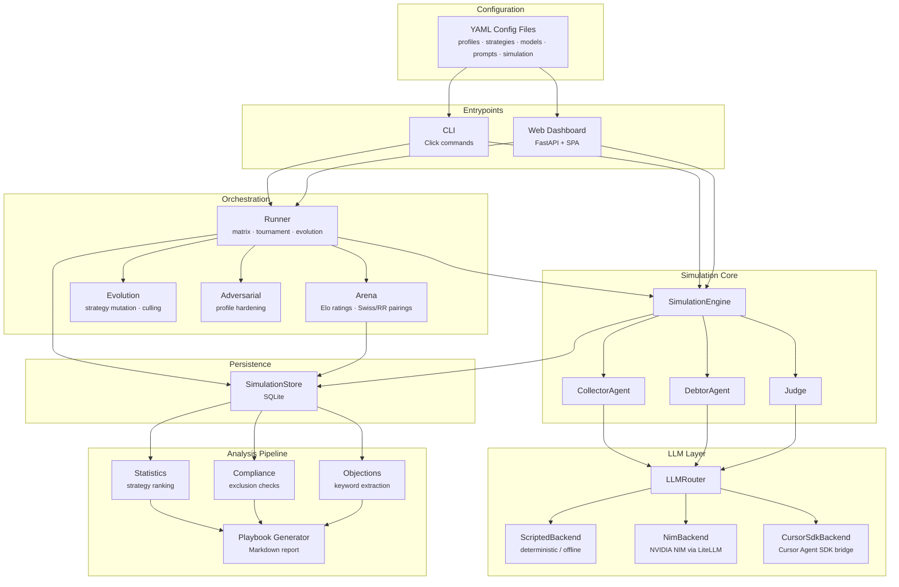
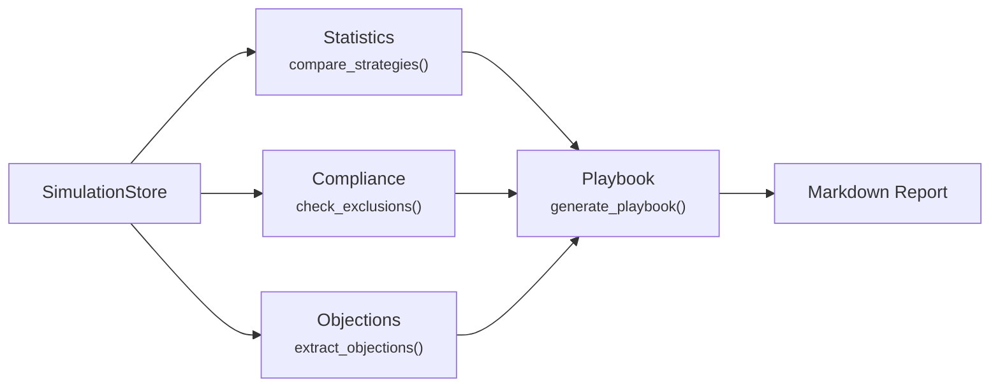
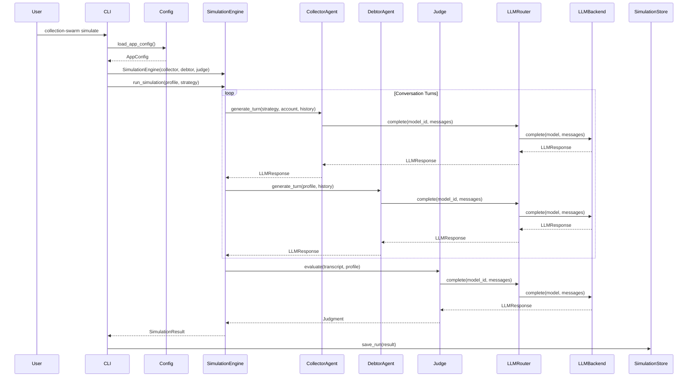

# Architecture Overview

Collection Swarm is a modular, provider-agnostic simulation platform that pits **collector strategies** against **debtor profiles** in realistic debt collection conversations, then scores the outcomes with an impartial **judge**. Every component is designed for offline-first operation, YAML-driven configuration, and seamless swapping of LLM backends.

---

## System Architecture



---

## Component Descriptions

### CLI

| | |
|---|---|
| **Module** | `collection_swarm.cli` |
| **Framework** | [Click](https://click.palletsprojects.com/) + [Rich](https://rich.readthedocs.io/) |
| **Role** | Primary user-facing entrypoint for running simulations, tournaments, evolution cycles, analysis, and the web server |

The CLI exposes subcommands for every workflow:

| Command | Purpose |
|---|---|
| `simulate` | Run a single profile × strategy simulation |
| `run` | Execute a full matrix of simulations |
| `tournament` | Launch an Elo-rated tournament |
| `evolve` | Run tournament-driven strategy evolution |
| `analyze` | Generate the Markdown playbook |
| `calibrate` | Evaluate judge accuracy against human labels |
| `model-report` | Generate a Cursor model-role evaluation report |
| `serve` | Launch the web dashboard (Uvicorn) |
| `seed` | Generate realistic demo data |
| `leaderboard` | Display current Elo rankings |
| `test-connection` | Verify the default backend is reachable |

All commands accept `--config-dir` and `--db` to override configuration and storage paths.

---

### SimulationEngine

| | |
|---|---|
| **Module** | `collection_swarm.engine` |
| **Role** | Orchestrates a single conversation between a Collector and a Debtor, then hands the transcript to the Judge |

The engine implements the **conversation loop**:

1. Collector generates a turn via `CollectorAgent.generate_turn()`.
2. Check for the end signal (`[END_CONVERSATION]`) — if found, collector ended the call.
3. Debtor generates a turn via `DebtorAgent.generate_turn()`.
4. Check for the end signal — if found, debtor ended the call.
5. Run **stalemate detection** using `SequenceMatcher` similarity over a sliding window.
6. Repeat until `max_turns` is reached, a participant ends the call, or a stalemate is detected.
7. Pass the full transcript to `Judge.evaluate()` for scoring.

Token counts and estimated costs are accumulated across all turns.

!!! info "Progress Callbacks"
    The engine accepts an optional `on_progress` callback, used by the web dashboard to stream real-time simulation state to the frontend.

---

### Agents

#### CollectorAgent

| | |
|---|---|
| **Module** | `collection_swarm.agents.collector` |
| **Role** | Generates collector dialogue turns using a configured strategy and account data |

The collector receives:

- A **system prompt** templated with `Strategy` fields (tone, tactic, escalation style, etc.) and `AccountData` (debt amount, type, age).
- A **user prompt** containing the conversation history formatted as `Role: Content` lines.

#### DebtorAgent

| | |
|---|---|
| **Module** | `collection_swarm.agents.debtor` |
| **Role** | Generates debtor dialogue turns based on the debtor profile |

The debtor receives:

- A **system prompt** templated with `Profile` fields (archetype, financial situation, emotional state, backstory) and constraint descriptions.
- **History messages** mapped to `assistant` (own turns) and `user` (collector turns) roles for natural multi-turn LLM conversation.

#### Judge

| | |
|---|---|
| **Module** | `collection_swarm.agents.judge` |
| **Role** | Evaluates the completed transcript and produces a structured `Judgment` |

The judge:

1. Sends the transcript with account data and constraints to the LLM.
2. Parses the JSON response into a `Judgment` model, normalizing payment outcome aliases and score scales.
3. Runs **deterministic constraint verification** — checking max payment amounts, required actions (written proof demands, official channel citations), and merges any violations into the judgment.

!!! warning "Fallback Parsing"
    If the LLM returns unparseable output, the judge produces a fallback `Judgment` with conservative scores and a `judge_parse_failed` end reason.

---

### LLMRouter

| | |
|---|---|
| **Module** | `collection_swarm.backends.router` |
| **Role** | Dispatches LLM completion requests to the appropriate backend based on `ModelConfig.backend` |

The router maintains a `_BackendRegistry` that lazily instantiates backends on first use:

```
model_id → ModelConfig.backend → LLMBackend.complete()
```

Pre-registered backends:

| Backend Key | Class | Notes |
|---|---|---|
| `scripted` | `ScriptedBackend` | Always available, zero cost |
| `heuristic` | `ScriptedBackend` | Alias for scripted judge |
| `nim` | `NimBackend` | Lazy-loaded on first NIM request |
| `cursor_sdk` / `acp` | `CursorSdkBackend` | Lazy-loaded, shared instance |

---

### Backends

All backends implement the `LLMBackend` protocol — a single async method:

```python
async def complete(self, model: ModelConfig, messages: list[LLMMessage]) -> LLMResponse
```

#### ScriptedBackend

| | |
|---|---|
| **Module** | `collection_swarm.backends.scripted` |
| **Cost** | Zero |
| **Requires** | Nothing |

A deterministic, rule-based backend that makes the entire system usable without API keys. It detects the agent role from the system prompt and produces contextually appropriate Portuguese/English responses. The scripted judge returns structured JSON matching the `Judgment` schema.

!!! tip "Offline Development"
    The scripted backend is the default for both conversation and judge models, enabling full end-to-end testing without network access or API credentials.

#### NimBackend

| | |
|---|---|
| **Module** | `collection_swarm.backends.nim` |
| **Cost** | Per-token via NVIDIA NIM pricing |
| **Requires** | `NVIDIA_NIM_API_KEY` environment variable |

Routes completions through the [NVIDIA NIM](https://build.nvidia.com/) inference API using [LiteLLM](https://docs.litellm.ai/) as the HTTP client. Supports any model hosted on the NIM platform.

#### CursorSdkBackend

| | |
|---|---|
| **Module** | `collection_swarm.backends.cursor_sdk` |
| **Cost** | Per-token via Cursor pricing |
| **Requires** | `CURSOR_API_KEY` environment variable, Node.js 22+, `cursor_sdk_bridge/` |

Bridges to the [Cursor Agent SDK](https://github.com/cursor/cookbook) via a Node.js subprocess (`cursor_sdk_bridge/run.mjs`). Messages and configuration are passed as JSON over stdin/stdout.

---

### SimulationStore

| | |
|---|---|
| **Module** | `collection_swarm.store` |
| **Backend** | SQLite |
| **Default Path** | `output/collection_swarm.sqlite` |

The store persists all simulation data and provides analytical query methods:

| Table | Purpose |
|---|---|
| `runs` | Simulation results, transcripts, judgments, token counts |
| `elo_ratings` | Current Elo ratings per entity/model pair |
| `elo_history` | Full history of every Elo update |
| `tournaments` | Tournament metadata and configuration |
| `evolved_strategies` | LLM-generated strategy variants with lineage |
| `evolved_profiles` | Hardened profile variants with lineage |
| `calibration_labels` | Human-provided judge calibration scores |
| `judge_prompt_variants` | Versioned judge prompts with calibration scores |

The store auto-creates the schema on instantiation and handles column migrations via `_ensure_column`.

---

### Analysis Pipeline

The analysis pipeline transforms raw simulation data into actionable insights:



| Module | Responsibility |
|---|---|
| `analysis.statistics` | Ranks strategies by mean payment probability per profile (`StrategyRanking`) |
| `analysis.compliance` | Flags strategy–profile pairs that violate compliance thresholds (`ComplianceExclusion`) |
| `analysis.objections` | Extracts debtor objection categories from transcripts via keyword matching (`ObjectionReport`) |
| `analysis.playbook` | Assembles the final Markdown playbook with rankings, exclusions, objection playbooks, and example transcripts |

---

### Web Dashboard

| | |
|---|---|
| **Module** | `collection_swarm.web.app` |
| **Framework** | FastAPI + static SPA |
| **Launch** | `collection-swarm serve` |

The dashboard provides a full-featured web interface:

| API Group | Endpoints |
|---|---|
| **Dashboard** | `GET /api/dashboard` — aggregate statistics, outcome distribution, cost summary |
| **Runs** | `GET /api/runs`, `GET /api/runs/{id}` — list and inspect simulations |
| **Profiles** | `GET /api/config/profiles`, `GET /api/profiles/{id}/strategies`, `GET /api/profiles/{id}/objections` |
| **Strategies** | `GET /api/config/strategies` |
| **Compliance** | `GET /api/compliance/exclusions` |
| **Playbook** | `GET /api/playbook` — rendered HTML or raw Markdown |
| **Arena** | `GET /api/arena/leaderboard`, `GET /api/arena/history/{id}`, `GET /api/arena/tournaments` |
| **Evolution** | `GET /api/evolution/pool` |
| **Jobs** | `POST /api/jobs/simulations`, `POST /api/jobs/matrix`, `POST /api/jobs/tournaments`, `POST /api/jobs/model-benchmarks` |
| **Manual Play** | `POST /api/manual-sessions`, `POST /api/manual-sessions/{id}/turn`, `POST /api/manual-sessions/{id}/finish` |
| **Calibration** | `GET /api/calibration/results`, `POST /api/calibration/labels`, `GET /api/calibration/variants` |
| **Benchmarks** | `GET /api/model-benchmarks`, `GET /api/model-benchmarks/{id}` |

All job endpoints return a `WebRunJob` snapshot with progress tracking. Background tasks use `asyncio.create_task` with semaphore-based concurrency control.

!!! note "Security"
    Playbook HTML output is sanitized via `bleach` to prevent XSS from YAML-defined content injected through `markdown.markdown()`.

---

## Component Interaction Flow



---

## Design Principles

### Separation of Concerns

Each layer has a single responsibility:

- **Configuration** — YAML loading and validation (`config.py`)
- **Agents** — Prompt construction and role behavior (`agents/`)
- **Backends** — LLM API communication (`backends/`)
- **Engine** — Conversation loop orchestration (`engine.py`)
- **Orchestration** — Multi-run coordination, tournaments, evolution (`runner.py`, `arena.py`, `evolution.py`)
- **Persistence** — Data storage and querying (`store.py`)
- **Analysis** — Post-hoc data analysis (`analysis/`)
- **Presentation** — CLI output and web dashboard (`cli.py`, `web/`)

### Provider-Agnostic Backends

The `LLMBackend` protocol defines a minimal interface (`complete(model, messages) → LLMResponse`). Adding a new LLM provider requires:

1. Implementing the `LLMBackend` protocol in a new module.
2. Registering the backend key in `_BackendRegistry.__missing__()`.
3. Adding a model entry in `config/models.yaml` with the new backend name.

No changes to agents, engine, or analysis code are needed.

### Offline-First

The `ScriptedBackend` provides deterministic, zero-cost completions for every agent role. This means:

- **Development**: Full test cycles without API keys or network.
- **CI/CD**: Automated tests run entirely offline.
- **Demos**: Seed data generation works out of the box.
- **Calibration**: Baseline judge behavior is reproducible and version-controlled.

### YAML Configuration

All behavioral parameters are externalized to YAML files under `config/`:

| File | Contents |
|---|---|
| `debtor_profiles.yaml` | Debtor archetypes, financial situations, constraints |
| `collector_strategies.yaml` | Collection tactics, tone, escalation styles |
| `models.yaml` | LLM model registry with backend bindings and costs |
| `prompts.yaml` | System and user prompt templates for all agents |
| `simulation.yaml` | Conversation limits, stalemate detection, compliance thresholds, arena settings |

This design enables non-engineers to tune simulation behavior, add new scenarios, and adjust compliance thresholds without modifying code.
