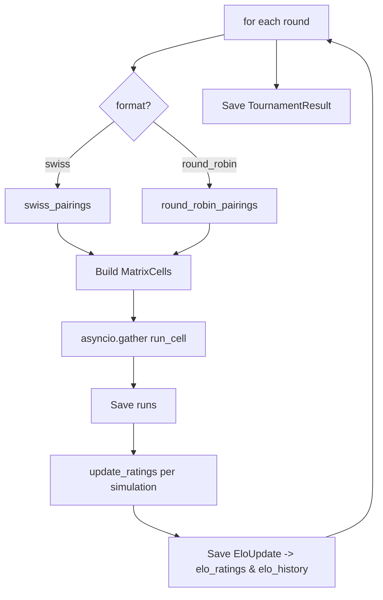

# Arena & evolution

Mean payment probability is a useful first metric, but it doesn't tell you
which Strategy is actually *better* than another. Two Strategies with
identical means may have radically different per-Profile profiles. The
arena and evolution loops solve that with Elo and an LLM-driven mutation
loop.

## The arena

The arena lives in [`arena.py`](../modules/arena.md). It is intentionally
small and exposes four primitives:

- `elo_expected(rating_a, rating_b)` — standard Elo expectation curve.
- `elo_update(rating, expected, actual, k)` — single rating update.
- `effective_score(judgment, scoring)` — turns a `Judgment` into a 0–1
  score. The default `payment_x_compliance` multiplies
  `payment_probability * compliance_score`, so a strategy that lands
  payments by being abusive cannot score perfectly. The `payment_only`
  alternative is available for ablations.
- `k_factor(games_played, initial, stable, threshold)` — higher K while a
  rating is unstable, lower K once it has settled.

`update_ratings(strategy_rating, profile_rating, judgment, simulation_id)`
is the single entry point used by the runner: it produces two `EloUpdate`
objects, one for the strategy side and one for the profile (mirror)
score. The Profile is the *opponent* in the arena framing — a hard
Profile is one that resists payment.

### Pairings

- `round_robin_pairings(strategy_ids, profile_ids)` — every Strategy
  faces every Profile each round. Use this for small or stable
  populations.
- `swiss_pairings(strategy_ratings, profile_ratings, history)` — sorts
  by `(games_played, -rating)` and matches without repeats. Falls back to
  the highest-rated remaining Profile if a no-repeat match is impossible.

## Tournament configuration

Defaults live in `config/simulation.yaml`:

```yaml
arena:
  default_format: swiss
  default_rounds: 4
  k_factor_initial: 32
  k_factor_stable: 16
  k_factor_threshold: 30
  scoring: payment_x_compliance
```

Override per CLI invocation:

```bash
collection-swarm tournament --format swiss --rounds 6 --concurrency 4
```

`run_tournament()` in [`runner.py`](../modules/runner.md) drives the
tournament:



The leaderboard is queryable with `collection-swarm leaderboard` or
`GET /api/arena/leaderboard`. Reset everything with
`collection-swarm reset-elo` if you need a clean slate.

## Strategy evolution

`run_evolution_cycle()` wraps `run_tournament()` with a generation loop:

1. Run a tournament with the current Strategy population.
2. Pull the leaderboard.
3. Take the **top K** as parents and the **bottom K** as failures.
4. Pull the worst few transcripts so the evolver has concrete failure
   modes to react to.
5. Call [`evolution.evolve_strategies`](../modules/evolution.md) on the
   evolver model. The evolver is given the parents, the failures, and the
   transcripts and asked to return a YAML block of new candidate
   Strategies under a top-level `strategies:` key.
6. Each parsed candidate is validated against the `Strategy` Pydantic
   schema and persisted with a `StrategyLineage` (generation, mutation
   type, parent IDs).
7. `cull_strategies()` keeps the seed Strategies plus the top of the
   evolved pool, capped at `population_size - len(seeds)`.
8. Optionally, `harden_profiles()` mirrors the same pattern on the Profile
   side — given an "easy" Profile and a winning transcript, produce a
   harder variant.

The fallback paths are deliberate: if the evolver returns nothing
parseable, `_fallback_strategy()` clones the top parent with a tagged
rationale so the cycle still moves forward instead of crashing. Same for
`_fallback_profile()`.

## Why payment × compliance, not payment alone

The default scoring exists because Collection Swarm is meant to surface
strategies a real operator could deploy. A strategy that scores 0.95
payment probability and 0.20 compliance is unusable — it would generate
complaints, regulatory risk, and litigation faster than it generates
collections. By multiplying the two scores, the arena penalizes any
strategy that wins by being aggressive enough to fail compliance review.

If you want to study the trade-off explicitly, switch the arena to
`payment_only` and re-run, then compare leaderboards. That ablation lives
in `config/simulation.yaml > arena.scoring`.
