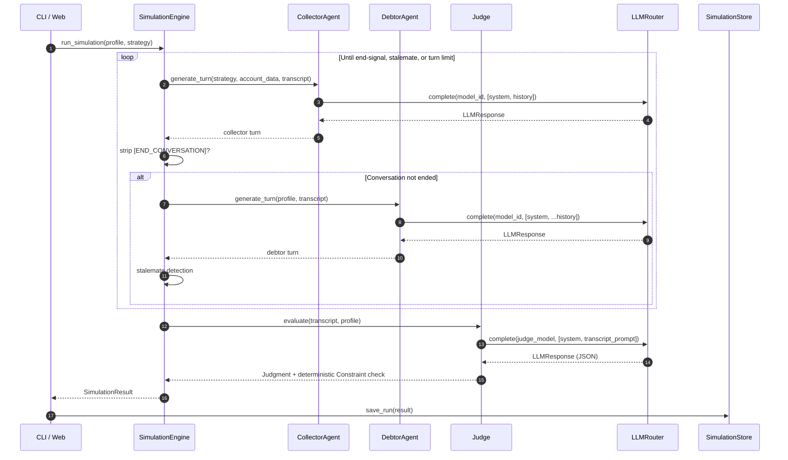

# Conversation lifecycle

This page is the procedural counterpart of [Domain model](domain-model.md):
what actually happens, in what order, when you call
`engine.run_simulation()`.

## Sequence diagram



## What each step does in code

The relevant code lives in [`engine.py`](../modules/engine.md). At a high
level:

1. `SimulationEngine.__init__` is given pre-built `CollectorAgent`,
   `DebtorAgent`, and `Judge` instances plus the conversation settings
   (`max_turns`, `end_signal`, `stalemate_window`,
   `stalemate_similarity_threshold`).
2. `run_simulation()` creates a fresh `SimulationResult` with a generated
   ID and the model identifiers attached.
3. The main loop alternates Collector → Debtor turns. After each turn the
   engine:
   - Increments token / cost counters from the `LLMResponse`.
   - Strips the `end_signal` from the content with `strip_end_signal()`.
   - Sets `result.ended_by` if a Participant emitted the signal.
   - Calls the optional `on_progress` callback (used by the dashboard for
     streaming).
4. `_stalemate_detected()` checks the last `stalemate_window` Collector /
   Debtor pairs against the baseline pair using `difflib.SequenceMatcher`.
   If every newer pair is similar enough to the baseline, the conversation
   is short-circuited as `EndedBy.STALEMATE`.
5. If the loop exits because `len(transcript) >= max_turns` and no
   `ended_by` was set, it stamps `EndedBy.TURN_LIMIT`.
6. `judge.evaluate(transcript, profile)` is called once on the full
   transcript. The Judge's `LLMResponse` contributes its tokens and cost
   to the result.
7. The Judge merges its LLM `constraint_violations` with the deterministic
   ones produced by `verify_constraints()` (de-duplicated, order
   preserved).
8. `ended_at` is stamped, the result is returned.

If anything raises inside the loop, the engine catches the exception,
flips `status` to `failed`, records the message in `error_message`, and
still returns a `SimulationResult` so the runner can record the failure
without crashing the matrix.

## Termination guards

| Guard                | Source                                                                  | Wins when                                                                            |
| -------------------- | ----------------------------------------------------------------------- | ------------------------------------------------------------------------------------ |
| `[END_CONVERSATION]` | Either Participant emits the literal token                              | The signal is detected on a turn (Participant marked as `ended_by`).                |
| Stalemate            | `engine._stalemate_detected` over the trailing N turn pairs             | All newer pairs are within the configured similarity threshold to the baseline pair. |
| Turn limit           | `len(transcript) >= max_turns`                                          | Neither Participant emitted the signal and no stalemate was detected.                |

`ended_by` always reflects the *first* mechanical signal: it does not change
once set.

## On-progress callbacks

Both the CLI and the dashboard pass an `on_progress` callback to
`run_simulation()`. The callback is invoked after every turn and once
again when the result is finalized. The dashboard uses this to mirror the
in-flight `SimulationResult` into the `WebRunJob` snapshot, which is what
the SPA polls to stream the transcript live.

The signature is liberal:

```python
on_progress: Callable[[SimulationResult], Awaitable[None] | None]
```

It can be sync or async — the engine awaits the result if needed via
`inspect.isawaitable`.

## End reason vs ended_by

These two fields are easy to confuse and intentionally separate:

| Field         | Set by                | Purpose                                                          |
| ------------- | --------------------- | ---------------------------------------------------------------- |
| `ended_by`    | The engine            | Mechanical signal: who hung up, did we stalemate, did we time out. |
| `end_reason`  | The Judge             | Semantic classification: was an agreement reached, did the debtor defer, was no resolution reached. |

A run can have `ended_by="collector"` and `end_reason="agreement_reached"`
(the Collector closed because terms were agreed). It can also have
`ended_by="debtor"` and `end_reason="debtor_hung_up"` (the Debtor cut the
call). Both pieces are useful and both are persisted to SQLite.
