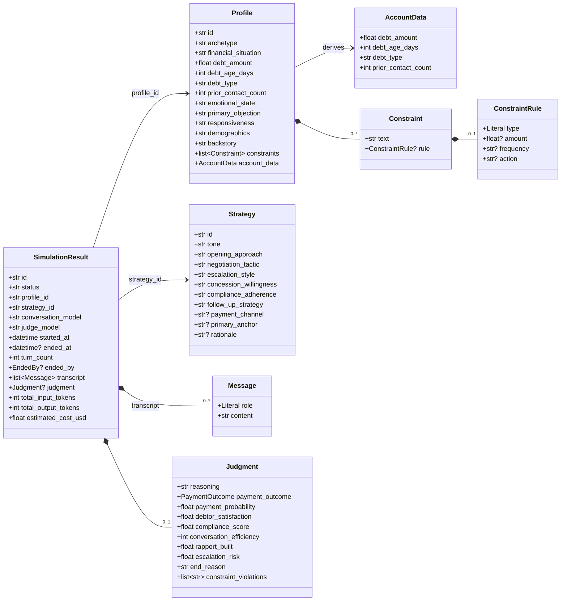

# Domain model

Every object that flows through Collection Swarm is a Pydantic model
defined in [`models.py`](../modules/models.md). This page is the visual
overview; the module page is the field-by-field reference.

## Class diagram

## How the data is sourced

| Object               | Source                                              |
| -------------------- | --------------------------------------------------- |
| `Profile`            | `config/debtor_profiles.yaml`                       |
| `Strategy`           | `config/collector_strategies.yaml`                  |
| `ModelConfig`        | `config/models.yaml`                                |
| `PromptConfig`       | `config/prompts.yaml`                               |
| `SimulationSettings` | `config/simulation.yaml`                            |
| `Message`            | Generated turn by turn by Collector / Debtor agents  |
| `Judgment`           | Returned by the Judge agent (LLM JSON + parser)      |
| `SimulationResult`   | Built by `SimulationEngine.run_simulation()`         |

## Visibility rules

This is the most important slide:

| Object        | Collector sees | Debtor sees | Judge sees                |
| ------------- | -------------- | ----------- | ------------------------- |
| `Strategy`    | Yes            | No          | No                        |
| `Profile.persona` (backstory, constraints, emotional_state) | No | Yes | Constraints only |
| `AccountData` (debt amount, type, age, prior contacts) | Yes | Implicit (via persona) | Yes |
| `Transcript`  | Yes (history)  | Yes (history) | Yes (full)              |

The Judge does not see the Strategy definition or the Profile's
analytical Tags. It evaluates the conversation on its merits, not on what
was *intended*. This separation is what makes the Judge a credible
evaluator instead of a rubber-stamp on the Collector's plan.

## Tournament & evolution data

The arena and evolution loops add a few more shapes on top:

| Object              | Where it lives                          |
| ------------------- | --------------------------------------- |
| `EloRating`         | `elo_ratings` SQLite table              |
| `EloUpdate`         | `elo_history` SQLite table              |
| `TournamentConfig`  | `config/simulation.yaml` (`arena:`)     |
| `TournamentResult`  | `tournaments` SQLite table              |
| `EvolutionConfig`   | CLI flags / programmatic `EvolutionConfig` |
| `StrategyLineage`   | `evolved_strategies` SQLite table       |
| `ProfileLineage`    | `evolved_profiles` SQLite table         |

See [Arena & evolution](arena-and-evolution.md) for how they tie back into
`SimulationResult`.
