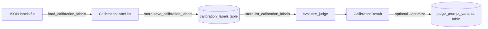

# Judge calibration

The Judge is the single most important agent in Collection Swarm — every
downstream metric, every Playbook, every Compliance Exclusion derives
from its output. The calibration pipeline lets you measure how well the
Judge agrees with humans and iterate on the prompt accordingly.

## Data model

[`calibration.py`](../modules/calibration.md) defines two Pydantic models:

- `CalibrationLabel` — `transcript_id`, `human_scores: dict[str, float]`,
  `labeler_id`, `timestamp`. Each label can score any subset of the
  Judgment metrics on a 0–1 scale.
- `CalibrationResult` — `correlations: dict[str, float]`,
  `mae: dict[str, float]`, `overall_score: float`, `label_count: int`.

The `correlations` field is the per-metric Pearson correlation between
human scores and the Judge's stored values; `mae` is the mean absolute
error; `overall_score` is the unweighted mean of the correlations.

## How calibration works



### Loading labels

```bash
collection-swarm calibrate --labels labels.json --optimize
```

The `labels.json` payload is a list of `CalibrationLabel` JSON objects:

```json
[
  {
    "transcript_id": "sim_a1b2c3d4e5f6",
    "human_scores": {
      "payment_probability": 0.7,
      "compliance_score": 1.0
    },
    "labeler_id": "alice"
  }
]
```

Each label is upserted into `calibration_labels` keyed by
`(transcript_id, metric, labeler_id)`. Re-uploading the same key replaces
the score and updates the `labeled_at` timestamp.

### Evaluating

`evaluate_judge(labels, store)` joins labels to runs by `transcript_id`,
extracts the corresponding fields from each `Judgment`, computes Pearson
correlations and MAE per metric, and returns a `CalibrationResult`.

Labels referencing missing or pre-Judgment runs are silently skipped, but
the count of *used* labels is reported as `label_count` so you can spot a
drift between "labels uploaded" and "labels that actually scored".

### Saving a prompt variant

When you pass `--optimize`, the current Judge system + transcript prompts
are stored in `judge_prompt_variants` along with the calibration score.
Variants are timestamped (`judge_YYYYMMDDHHMMSSffffff`) so you can browse
the history and revert to a known-good prompt.

The web dashboard exposes this through `GET /api/calibration/variants`.

## Recommended workflow

1. **Build a labeled set.** Pick 30–50 representative transcripts spanning
   profiles, strategies, and outcome categories. Label them in a
   spreadsheet, then export to the JSON shape above.
2. **Run a baseline calibration.** `collection-swarm calibrate --labels
   baseline.json` (without `--optimize`). Read the per-metric Pearson
   correlation. Anything below ~0.5 is suspect.
3. **Identify the weak metrics.** `compliance_score` is usually the
   hardest because it is the most regulator-sensitive.
4. **Edit the Judge prompt** in `config/prompts.yaml` to address the gap.
5. **Re-run with `--optimize`.** The variant lands in the database. Check
   `judge_prompt_variants` to confirm the score moved in the right
   direction.
6. **Iterate.** Two or three rounds is usually enough.

## Pearson, not Spearman

Collection Swarm uses Pearson correlation deliberately: most metrics are
naturally continuous and roughly linear, and Pearson penalizes magnitude
errors that Spearman would hide. If you want a rank-only check, run
Spearman by hand on the exported labels — the calibration table holds the
raw human scores so it's a one-liner in pandas.

## What this is not

The calibration loop tracks **agreement with humans** on the metrics the
Judge already produces. It does **not**:

- Change the Judge's training data.
- Override Judgments after the fact.
- Re-score historical runs.

If a prompt variant materially changes the Judge's scoring, re-run the
relevant Simulations (or the whole matrix) before drawing new
conclusions. Don't compare apples and oranges across prompt versions.
