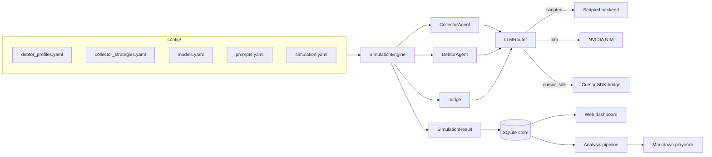

v0.1 · Synthetic collection research

# Stress-test collection strategies before they touch a real customer.

A Python simulator that runs multi-turn negotiations between an AI
<em>Collector</em>, an AI <em>Debtor</em>, and an AI <em>Judge</em> — then ranks
what actually works across debtor archetypes, models, and tactics. Offline by
default, live-model-ready when you want it.

[:material-rocket-launch-outline: Quick start](getting-started/install.md){ .md-button .md-button--primary }
[:material-book-open-page-variant-outline: Read the concepts](concepts/index.md){ .md-button }
[:material-source-branch: Source on GitHub](https://github.com/pedrochagasmaster/collection-swarm){ .md-button }

<ol class="cs-hero__loop">
  <li><b>01</b>YAML config defines profiles, strategies, models, prompts.</li>
  <li><b>02</b>Engine alternates Collector and Debtor turns to a transcript.</li>
  <li><b>03</b>Router dispatches model calls to scripted, NIM, or Cursor SDK.</li>
  <li><b>04</b>Judge scores the transcript and verifies hard constraints.</li>
  <li><b>05</b>Store persists runs for the dashboard, arena, and playbook.</li>
</ol>

## What you can do with it { .no-rule }

### [Run a single simulation](getting-started/install.md)
One Collector × Debtor × Judge conversation from one CLI call. No API keys
needed — the scripted backend is deterministic and offline.

### [Sweep a matrix](modules/runner.md)
Run every Profile × Strategy × Model combination under bounded concurrency
and fold the results into a single SQLite database.

### [Hold a tournament](modules/arena.md)
Elo-rate strategies against profiles across Swiss or round-robin rounds and
watch the leaderboard converge on what actually works.

### [Evolve new strategies](modules/evolution.md)
Let a strong model mutate and recombine the bottom of the leaderboard into
new candidate strategies, generation after generation.

### [Browse the dashboard](getting-started/dashboard.md)
A FastAPI + vanilla-JS SPA exposes runs, transcripts, leaderboards, playbooks,
and a live manual role-play sandbox.

### [Plug in real models](getting-started/live-models.md)
Native backends for NVIDIA NIM and the Cursor SDK. Bring your own keys, or
stay fully offline with the deterministic scripted backend.

## How the system thinks { .no-rule }

A run flows left-to-right. Configuration drives the engine, the engine runs
three agents through one router, and the resulting `SimulationResult` is the
substrate every downstream report builds on.

## Read it like a book { .no-rule }

The docs are ordered the way a careful reader would explore the codebase —
from the surface, down through the architecture and concepts, into each
individual module, and back out to operator references.

### [1 · Getting started](getting-started/index.md)
Install the package, run the first offline simulation, point it at a real
provider, open the dashboard.

### [2 · Architecture](architecture/overview.md)
A system-level view: components, data flow through every workflow, and the
full Pydantic domain model.

### [3 · Concepts](concepts/index.md)
Vocabulary, conversation lifecycle, compliance guardrails, and how the
arena and the judge think.

### [4 · Modules](modules/index.md)
A file-by-file walkthrough of every module under `src/collection_swarm/`,
with signatures, diagrams, and the gotchas worth knowing.

### [5 · Catalog](catalog/profiles.md)
The fourteen bundled debtor profiles and the collector strategies they
negotiate against — archetypes, constraints, and demographics.

### [6 · Reference](reference/index.md)
Operator-level reference for the CLI, the HTTP API, the YAML configuration
files, the SQLite schema, and the full glossary.

!!! warning "Synthetic data only"
    Every profile, debtor, and transcript in this repository is generated for
    research. Do not ingest real consumer records, do not treat Judge output
    as legal advice, and do not deploy a strategy without human review. See
    [Compliance & guardrails](concepts/compliance.md) for the full stance.
