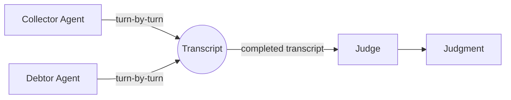

# Agent Architecture Overview

Collection Swarm uses a **three-agent architecture** to simulate realistic debt collection conversations and evaluate their outcomes. Each agent is an independent LLM-driven participant with strictly scoped information boundaries, ensuring that no agent has a global view of the scenario.

---

## The Three Agents



| Agent | Role | Module | Purpose |
|---|---|---|---|
| **Collector** | Participant | `agents/collector.py` | Generates collection agent dialogue using a strategy and account data |
| **Debtor** | Participant | `agents/debtor.py` | Generates debtor dialogue using a behavioral profile and constraints |
| **Judge** | Evaluator | `agents/judge.py` | Reads the completed transcript and produces a structured `Judgment` |

---

## Conversation Flow

The simulation engine orchestrates alternating turns between the Collector and Debtor agents. Once the conversation concludes (via end signal, turn limit, or stalemate detection), the full transcript is handed to the Judge for evaluation.

```
┌─────────────────────────────────────────────────────────┐
│                   SimulationEngine                       │
│                                                         │
│   1. Collector generates opening turn                   │
│   2. Debtor responds                                    │
│   3. Repeat until end condition                         │
│   4. Judge evaluates the full transcript                │
│                                                         │
│   End conditions:                                       │
│   • [END_CONVERSATION] signal in a message              │
│   • max_turns reached                                   │
│   • Stalemate detected (similarity threshold exceeded)  │
└─────────────────────────────────────────────────────────┘
```

---

## Information Visibility

A critical design principle is that each agent operates under **asymmetric information**. This mirrors real-world conversations where each party knows different things.

### Visibility Matrix

| Data | Collector | Debtor | Judge |
|---|:---:|:---:|:---:|
| **Strategy** (tone, tactics, escalation) | ✅ Yes | ❌ No | ❌ No |
| **AccountData** (debt amount, age, type) | ✅ Yes | ◐ Via profile | ✅ Yes |
| **Profile** (archetype, backstory, emotional state) | ❌ No | ✅ Yes | ◐ Partial |
| **Constraints** (max payment, required actions) | ❌ No | ✅ Yes | ✅ Yes |
| **Transcript** (full conversation) | ◐ Own history | ◐ Own history | ✅ Yes |

!!! info "Why asymmetric information matters"
    The Collector never sees the debtor's backstory, emotional state, or constraints — it must adapt in real time based on the debtor's responses, just like a real collection agent. The Judge sees the constraints but never sees the strategy, ensuring unbiased evaluation of conversational outcomes.

---

## Agent Construction

All three agents share a common construction pattern:

```python
agent = Agent(
    router=router,        # LLMRouter — dispatches to the correct backend
    model_id=model_id,    # Which model to use (e.g., "scripted", "nim-llama-3.1")
    prompts=prompt_config # Role-specific prompt templates
)
```

The `LLMRouter` handles backend dispatch, so agents are backend-agnostic — the same `CollectorAgent` works whether backed by a scripted engine, NVIDIA NIM, or the Cursor SDK.

---

## Prompt Configuration

Each agent has a dedicated prompt config class defined in `models.py`:

| Agent | Config Class | Key Fields |
|---|---|---|
| Collector | `CollectorPromptConfig` | `system`, `history_empty`, `history` |
| Debtor | `DebtorPromptConfig` | `system`, `constraints_empty`, `history_message` |
| Judge | `JudgePromptConfig` | `system`, `transcript` |

Prompt templates are loaded from `config/prompts.yaml` at startup and support Python `str.format()` interpolation with domain objects.

---

## Output: The Judgment

After evaluating a completed transcript, the Judge produces a structured [`Judgment`](../../architecture/domain-model.md#judgment) object:

| Field | Type | Range | Description |
|---|---|---|---|
| `reasoning` | `str` | — | Free-text explanation of the evaluation |
| `payment_outcome` | `PaymentOutcome` | enum | One of 7 outcomes (full payment → hang up) |
| `payment_probability` | `float` | 0.0–1.0 | Likelihood the debtor will actually pay |
| `debtor_satisfaction` | `float` | 0.0–1.0 | How satisfied the debtor feels |
| `compliance_score` | `float` | 0.0–1.0 | Regulatory compliance of the conversation |
| `conversation_efficiency` | `int` | ≥ 0 | Number of turns in the conversation |
| `rapport_built` | `float` | 0.0–1.0 | Quality of rapport established |
| `escalation_risk` | `float` | 0.0–1.0 | Risk of complaint or escalation |
| `end_reason` | `str` | — | Why the conversation ended |
| `constraint_violations` | `list[str]` | — | Any profile constraints that were violated |

!!! tip "Two-pass evaluation"
    The Judge uses a **two-pass** approach: first an LLM-based qualitative scoring pass, then a **deterministic constraint verification** pass that checks hard rules (max payment amounts, required actions) using regex and keyword matching. Violations from both passes are merged and deduplicated.

---

## Further Reading

- [Collector Agent](collector.md) — detailed API and prompt construction
- [Debtor Agent](debtor.md) — profile-aware response generation
- [Judge](judge.md) — evaluation pipeline and constraint verification
- [Backend Overview](../backends/index.md) — how LLM calls are dispatched
