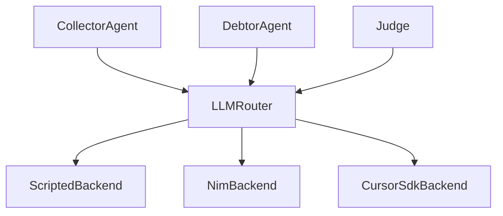

# Backend System Overview

Collection Swarm uses a **provider-agnostic backend architecture** that lets the same agent code run against multiple LLM providers — from deterministic local heuristics to cloud-hosted models — without any changes to the agent logic.

---

## Architecture



All LLM calls flow through the `LLMRouter`, which dispatches to the correct backend based on the `ModelConfig.backend` field. Agents never interact with backends directly.

---

## The `LLMBackend` Protocol

Every backend implements the `LLMBackend` protocol defined in `backends/base.py`:

```python
class LLMBackend(Protocol):
    async def complete(
        self,
        model: ModelConfig,
        messages: list[LLMMessage],
    ) -> LLMResponse:
        """Return a completion for the configured model."""
```

This is a Python `Protocol` — backends don't need to inherit from it; they just need to implement the `complete` method with the correct signature.

| Parameter | Type | Description |
|---|---|---|
| `model` | `ModelConfig` | Model configuration (id, backend name, provider, cost rates) |
| `messages` | `list[LLMMessage]` | Chat messages with `role` (`system`, `user`, `assistant`) and `content` |

---

## `LLMResponse` Dataclass

Every backend returns an `LLMResponse`:

```python
@dataclass(frozen=True)
class LLMResponse:
    content: str
    input_tokens: int = 0
    output_tokens: int = 0
    estimated_cost_usd: float = 0.0
    model_id: str = ""
    backend: str = ""
```

| Field | Type | Description |
|---|---|---|
| `content` | `str` | The generated text response |
| `input_tokens` | `int` | Number of input/prompt tokens consumed |
| `output_tokens` | `int` | Number of output/completion tokens generated |
| `estimated_cost_usd` | `float` | Estimated API cost for this completion |
| `model_id` | `str` | Which model produced this response |
| `backend` | `str` | Which backend handled the request (e.g., `"scripted"`, `"nim"`, `"cursor_sdk"`) |

!!! note "Frozen dataclass"
    `LLMResponse` is a frozen dataclass — instances are immutable after creation. This is intentional: responses are passed through multiple pipeline stages and should never be accidentally mutated.

---

## Available Backends

| Backend | Class | Module | API Keys Required | Use Case |
|---|---|---|---|---|
| **Scripted** | `ScriptedBackend` | `backends/scripted.py` | None | Offline development, testing, CI — deterministic heuristic responses |
| **NIM** | `NimBackend` | `backends/nim.py` | Dashboard/CLI key store or `NVIDIA_NIM_API_KEY` | Production-grade LLM inference via NVIDIA NIM |
| **Cursor SDK** | `CursorSdkBackend` | `backends/cursor_sdk.py` | Dashboard/CLI key store or `CURSOR_API_KEY` | Cursor coding agent API via Node.js bridge |

### Backend Selection

Backends are selected per-model in `config/models.yaml`:

```yaml
tiers:
  offline:
    models:
      - id: scripted
        backend: scripted
        provider: local

  cloud:
    models:
      - id: nim-llama-3.1-70b
        backend: nim
        provider: nvidia
        model_name: nvidia/llama-3.1-70b-instruct
        input_cost_per_m: 0.35
        output_cost_per_m: 0.40

      - id: cursor-claude-sonnet
        backend: cursor_sdk
        provider: cursor
        model_name: claude-sonnet-4-20250514
        input_cost_per_m: 3.00
        output_cost_per_m: 15.00
```

---

## `ModelConfig`

Each model is configured with:

```python
class ModelConfig(BaseModel):
    id: str                          # Unique identifier used to reference this model
    backend: str                     # Backend name: "scripted", "nim", "cursor_sdk"
    provider: str = "local"          # Provider label (informational)
    input_cost_per_m: float = 0.0    # Cost per million input tokens (USD)
    output_cost_per_m: float = 0.0   # Cost per million output tokens (USD)
    model_name: str | None = None    # Provider-specific model name (used by NIM/Cursor SDK)
```

The `litellm_model` property returns `model_name` if set, otherwise falls back to `id`:

```python
@property
def litellm_model(self) -> str:
    return self.model_name or self.id
```

---

## `LLMMessage`

Messages passed to backends follow a simple structure:

```python
class LLMMessage(BaseModel):
    role: Literal["system", "user", "assistant"]
    content: str
```

!!! info "Domain roles vs. LLM roles"
    The domain uses `"collector"`, `"debtor"`, `"system"`, and `"judge"` roles (in the `Message` model). These are mapped to standard LLM roles (`"system"`, `"user"`, `"assistant"`) by each agent before being passed to the backend. See the [Debtor Agent docs](../agents/debtor.md) for an example of this mapping.

---

## Further Reading

- [Base & LLM Router](base-and-router.md) — dispatch logic and backend registry
- [Scripted Backend](scripted.md) — deterministic offline backend
- [NIM Backend](nim.md) — NVIDIA NIM API integration
- [Cursor SDK Backend](cursor-sdk.md) — Cursor coding agent via Node.js bridge
- [Agent Architecture](../agents/index.md) — how agents use the backend system
