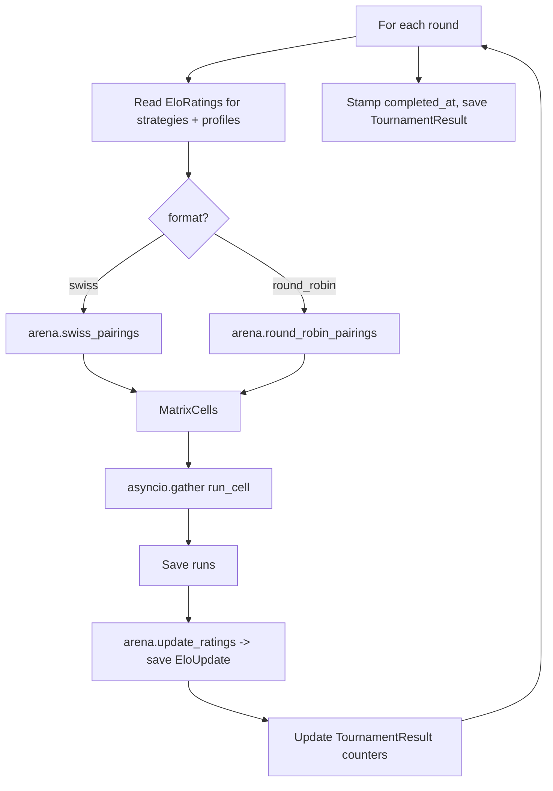

# `runner.py` — matrix and tournament orchestration

<span class="cs-kicker">collection_swarm/runner.py</span>

Three async entry points. Each one builds the right set of `MatrixCell`s,
schedules `SimulationEngine.run_simulation()` calls under a semaphore,
persists results, and returns a typed summary.

<dl class="cs-summary">
  <dt>Imports</dt><dd>asyncio, the agents, the router, the engine, the arena, the evolution &amp; adversarial helpers, the store</dd>
  <dt>Concurrency</dt><dd>One <code>asyncio.Semaphore</code> per call; <code>asyncio.gather</code> over the resulting tasks</dd>
  <dt>Failure model</dt><dd>Failed simulations are persisted as <code>status="failed"</code> rows; they don't take down the matrix</dd>
</dl>

## Building a matrix

```python
def build_matrix(
    config: AppConfig,
    profile_ids: list[str] | None = None,
    strategy_ids: list[str] | None = None,
    conversation_models: list[str] | None = None,
    judge_models: list[str] | None = None,
    reps: int = 1,
) -> list[MatrixCell]: ...
```

Defaults to *every* Profile, *every* Strategy, the default conversation
model, and the default judge model. For each combination, it appends
`reps` identical `MatrixCell` rows so the runner can dispatch them
independently.

The function validates every ID by calling `config.profile(id)`,
`config.strategy(id)`, and `config.model(id)` — a typo fails fast with a
friendly KeyError before any compute starts.

## `run_matrix(config, store, cells, concurrency=2)`

Pure data fan-out:

```python
router = LLMRouter(config.models, cursor_sdk_prompts=config.prompts.cursor_sdk)
semaphore = asyncio.Semaphore(concurrency)

async def run_cell(cell: MatrixCell) -> SimulationResult:
    async with semaphore:
        engine = SimulationEngine(
            CollectorAgent(router, cell.conversation_model, config.prompts.collector),
            DebtorAgent(router, cell.conversation_model, config.prompts.debtor),
            Judge(router, cell.judge_model, config.prompts.judge),
            max_turns=settings.max_turns, ...
        )
        return await engine.run_simulation(config.profile(cell.profile_id), config.strategy(cell.strategy_id))

results = await asyncio.gather(*(run_cell(cell) for cell in cells))
store.save_runs(list(results))
```

Returns a `RunSummary(completed, failed, total, results)`. The caller
gets both the counts and the full list of `SimulationResult` objects in
case it wants to do further analysis without re-querying the store.

## `run_tournament(config, store, tournament_config, …)`

The tournament loop wraps `run_matrix` with arena bookkeeping:



Notable details:

- **Pool merging.** The runner unions `config.profiles` with
  `store.get_evolved_profile_pool()`, and `config.strategies` with
  `store.get_evolved_strategy_pool()`. Evolved entities can compete next
  to seed entities transparently.
- **History tracking.** A `set[(strategy_id, profile_id)]` is passed
  into Swiss pairing so the same matchup doesn't repeat unnecessarily
  inside one tournament.
- **Per-Judgment Elo.** Failed simulations (no `judgment`) skip the Elo
  update — there's no signal to feed in.
- **Tournament cost.** Every `simulation.estimated_cost_usd` is summed
  into `result.total_cost_usd` so the dashboard can show a budget.

The optional `on_round_complete(result)` callback fires after each round
with the partial `TournamentResult`. The web dashboard uses this to
stream Elo movement live; the CLI doesn't pass one.

## `run_evolution_cycle(...)`

Combines `run_tournament` with the evolution and adversarial hardening
steps. The full sequence per generation:

1. Run a tournament with the current active Strategy and Profile pools.
2. Sort Strategies by Elo. Take the top K as parents and the bottom K
   as failures.
3. Pull up to five worst-case transcripts from completed runs whose
   `strategy_id` is in the bottom K.
4. Call `evolve_strategies(parents, failures, transcripts, evolution_config, router)`.
5. Persist each evolved Strategy with a `StrategyLineage` (generation,
   `mutation_type="llm"`, parent IDs).
6. If `cull_bottom_n > 0`, run `cull_strategies()` with the new pool and
   call `store.cull_evolved_strategy()` on the losers.
7. If `hardening_config.enabled`, mirror the same loop on the Profile
   side using `harden_profiles()`.
8. Fire the optional `on_generation_complete(generation, tournament)`
   callback.

The function returns a list of `TournamentResult` objects — one per
generation — for downstream analysis.

## Why a single semaphore?

The router itself is shared across cells; LLM concurrency is bounded by
the semaphore. Two implications:

- **Cursor SDK throughput.** Each cell spawns one Node subprocess per
  turn. A `concurrency=8` setting can spawn many concurrent Node
  processes; check your `ulimit -n` if you scale up.
- **NIM rate limits.** LiteLLM doesn't enforce provider rate limits
  unless you configure them. Lower `concurrency` is the simplest knob.

## Returned shapes

| Function                | Return                                  |
| ----------------------- | --------------------------------------- |
| `build_matrix`          | `list[MatrixCell]`                      |
| `run_matrix`            | `RunSummary(completed, failed, total, results)` |
| `run_tournament`        | `TournamentResult` (also persisted)     |
| `run_evolution_cycle`   | `list[TournamentResult]`                |

All four are also driven by the dashboard's `_run_*_job` task functions
in [`web/app.py`](web/app.md).
