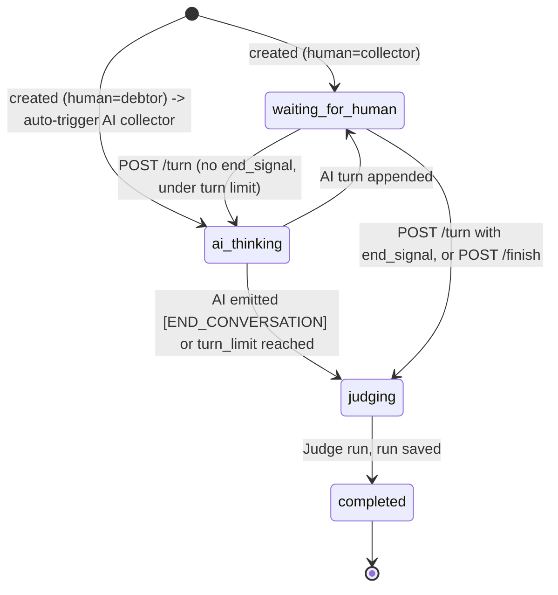

# `web/app.py` — the FastAPI dashboard

<span class="cs-kicker">collection_swarm/web/app.py</span>

The FastAPI application that powers the dashboard. 1,400 lines: pydantic
request schemas, the `WebRunJob` dataclass, ~30 endpoints, the long-running
job dispatcher, the manual-session machinery, and a Markdown sanitizer
for the rendered Playbook.

<dl class="cs-summary">
  <dt>Imports</dt><dd>FastAPI, Pydantic, bleach, markdown, the engine, the agents, the analysis pipeline, the model evaluation pipeline, the store</dd>
  <dt>State</dt><dd>Held on <code>app.state</code>: <code>jobs</code>, <code>tasks</code>, <code>manual_sessions</code>, <code>benchmark_reports</code>, <code>db_path</code></dd>
  <dt>Static</dt><dd>Mounted from <code>web/static/</code> at <code>/static</code></dd>
</dl>

## Construction

```python
def create_app(
    config_dir: Path = Path("config"),
    db_path: Path = Path("output/collection_swarm.sqlite"),
) -> FastAPI:
    app = FastAPI(title="Collection Swarm Dashboard", version="0.1.0")
    app.mount("/static", StaticFiles(directory=str(STATIC_DIR)), name="static")
    app.state.jobs = {}
    app.state.manual_sessions = {}
    app.state.benchmark_reports = {}
    app.state.tasks = {}
    app.state.db_path = db_path

    def _store() -> SimulationStore:
        return SimulationStore(db_path)

    def _config():
        return load_app_config(config_dir)
```

`_store()` opens a fresh `SimulationStore` per request — SQLite is
serialized inside the store and connections are short-lived, so this
shape is fine for the request volumes the dashboard actually sees.

`create_app_from_env()` is the factory uvicorn imports for reload mode.
The CLI's `serve` command rejects `--reload` because the configured
factory needs different arguments; it uses `uvicorn.run(create_app(...))`
directly.

## Request schemas

Every POST body is a Pydantic model:

| Schema                       | Endpoint                                |
| ---------------------------- | --------------------------------------- |
| `SimulationLaunchRequest`    | `POST /api/jobs/simulations`           |
| `MatrixLaunchRequest`        | `POST /api/jobs/matrix`                |
| `TournamentLaunchRequest`    | `POST /api/jobs/tournaments`           |
| `BenchmarkLaunchRequest`     | `POST /api/jobs/model-benchmarks`      |
| `ManualSessionRequest`       | `POST /api/manual-sessions`            |
| `ManualTurnRequest`          | `POST /api/manual-sessions/{id}/turn` |
| `CalibrationJobRequest`      | `POST /api/jobs/calibration`           |

Pydantic validators enforce friendly errors: `format` must be `swiss` or
`round_robin`, `human_role` must be `collector` or `debtor`, benchmark
roles must be a non-empty subset of `{collector, debtor, judge}`, etc.

## `WebRunJob`

The shape every long-running endpoint returns and the SPA polls.

```python
@dataclass
class WebRunJob:
    id: str
    kind: str   # "single" | "matrix" | "tournament" | "model_benchmark" | "calibration"
    status: str # "queued" | "running" | "completed" | "failed" | "cancelled"
    total: int = 1
    completed: int = 0
    failed: int = 0
    current_run: SimulationResult | None = None
    result_ids: list[str] = field(default_factory=list)
    errors: list[str] = field(default_factory=list)
    artifacts: dict[str, str] = field(default_factory=dict)
    benchmark_report: dict[str, Any] | None = None
    message: str = ""
    started_at: str = field(default_factory=lambda: utc_now().isoformat())
    ended_at: str | None = None
```

`current_run` carries the in-flight `SimulationResult`. The dispatcher
calls `result.model_copy(update={"status": "running" if ... else
result.status})` so the SPA sees a `status: running` while the engine
loop is still appending turns.

## Endpoint catalogue

The full list lives in [API reference](../../reference/api.md). The
ones worth highlighting here:

### Read-side

- `GET /api/dashboard` — overview (counts, outcome distribution, average
  scores, cost summary).
- `GET /api/runs` — list runs with optional `status`, `profile_id`,
  `strategy_id` filters.
- `GET /api/runs/{id}` — full `SimulationResult` JSON.
- `GET /api/profiles/{id}/strategies` — `StrategyRanking` for one Profile.
- `GET /api/compliance/exclusions` — current exclusions plus
  thresholds and minimum-runs hint.
- `GET /api/profiles/{id}/objections` — objection counts for the
  recommended (or chosen) Strategy.
- `GET /api/playbook?format=html|markdown` — rendered Playbook.

### Config introspection

- `GET /api/config/profiles` — Profiles with rolled-up performance.
- `GET /api/config/strategies` — Strategies with rolled-up performance.
- `GET /api/config/models` — Model catalogue with defaults.
- `GET /api/config/run-options` — combined Profile / Strategy / Model
  payload the launch screens consume.

### Arena

- `GET /api/arena/leaderboard?entity_type=&conversation_model=&judge_model=`
- `GET /api/arena/history/{entity_id}`
- `GET /api/arena/tournaments`
- `GET /api/arena/tournaments/{id}`

### Evolution & Calibration

- `GET /api/evolution/pool` — active evolved Strategies and Profiles
  with lineage.
- `POST /api/calibration/labels` — bulk label upload.
- `GET /api/calibration/results` — current Pearson + MAE.
- `POST /api/jobs/calibration` — fire `evaluate_judge` as a job.
- `GET /api/calibration/variants` — Judge prompt history.

### Model benchmarks

- `GET /api/model-benchmarks/options` — known Cursor model IDs and
  defaults.
- `GET /api/model-benchmarks` — list of saved benchmark reports.
- `GET /api/model-benchmarks/{job_id}` — single saved report.
- `POST /api/jobs/model-benchmarks` — fire a live benchmark.

### Job control

- `POST /api/jobs/simulations | matrix | tournaments | model-benchmarks | calibration`
- `GET  /api/jobs` and `/api/jobs/{id}`
- `POST /api/jobs/{id}/cancel` — flip status, mark task cancelled.

### Manual sessions

- `POST /api/manual-sessions` — create.
- `GET  /api/manual-sessions/{id}` — read.
- `POST /api/manual-sessions/{id}/turn` — submit human turn, AI replies.
- `POST /api/manual-sessions/{id}/finish` — close out, send to Judge.

## Job dispatchers

Five async functions, one per `kind`:

- `_run_single_job(...)` — straight-through `SimulationEngine.run_simulation`.
- `_run_matrix_job(...)` — semaphore + `asyncio.gather` over `MatrixCell`s.
- `_run_tournament_job(...)` — Swiss / round-robin pairings, mid-round
  Elo updates, tournament header save.
- `_run_calibration_job(...)` — wraps `evaluate_judge` and optionally
  saves a Judge variant.
- `_run_model_benchmark_job(...)` — orchestrates `run_live_role_probes`
  across one or more (Profile, Strategy, Judge profile) scenarios,
  builds a `ModelRoleReport`, writes Markdown + JSON artifacts to
  `output/benchmarks/`, and registers the report on `app.state.benchmark_reports`.

Every dispatcher has the same shape:

```python
try:
    job.status = "running"
    ...
    job.status = "completed" if not failures else "failed"
    job.ended_at = utc_now().isoformat()
except asyncio.CancelledError:
    raise
except Exception as exc:
    _fail_job(job, exc)
```

`asyncio.CancelledError` is re-raised so cancellation propagates;
everything else is captured in the job's `errors` list.

## Manual-session state machine

A `ManualSession` carries an in-flight `SimulationResult`, the
`human_role`, an `asyncio.Lock`, and a `status` ∈
{`waiting_for_human`, `ai_thinking`, `judging`, `completed`}. The
state transitions:



The lock guarantees one in-flight transition per session even under
concurrent requests.

## Markdown sanitization

```python
_PLAYBOOK_ALLOWED_TAGS = ["p", "h1", ..., "div"]
_PLAYBOOK_ALLOWED_ATTRS = {"a": ["href", "title"], ...}

def _render_safe_markdown(md_text: str) -> str:
    raw_html = markdown.markdown(md_text, extensions=["tables", "fenced_code"])
    return bleach.clean(
        raw_html,
        tags=_PLAYBOOK_ALLOWED_TAGS,
        attributes=_PLAYBOOK_ALLOWED_ATTRS,
        protocols=["http", "https", "mailto"],
        strip=True,
    )
```

This is the only place the dashboard converts Markdown to HTML. The
allow-list is tight on purpose: a Strategy YAML can in principle contain
arbitrary text, and the SPA injects this HTML via `innerHTML`. Without
sanitization, a `<script>` in the YAML would execute. With it, the tag
is silently dropped.
