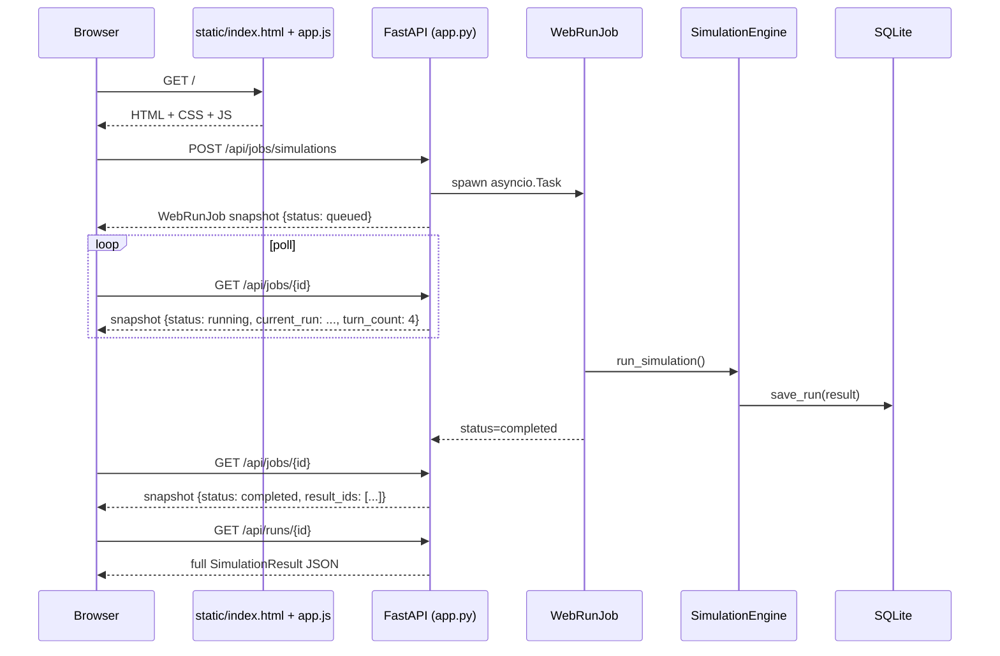

# Web

collection_swarm/web/

Three things live here:

| Path                       | Purpose                                                                          |
| -------------------------- | --------------------------------------------------------------------------------- |
| [`app.py`](app.md)         | The full FastAPI application: 30+ endpoints, the dashboard's job runner, manual sessions, the calibration & benchmark pipelines. |
| [`seed.py`](seed.md)       | Deterministic demo-data generator that lets the dashboard show meaningful charts before any real run. |
| [`static/`](static.md)     | Vanilla HTML / CSS / JS single-page application that consumes the FastAPI surface.|

## How a request flows

The SPA polls jobs at a low cadence (~1s), which is enough to show a
live transcript without crushing the server.

## Job kinds

Every long-running operation in the dashboard is one of:

- `single` — one Simulation.
- `matrix` — a list of `MatrixCell`s under a semaphore.
- `tournament` — a multi-round Elo tournament with mid-round Elo
  updates.
- `model_benchmark` — a per-role probe sweep across one or more Cursor
  SDK models. Produces a `ModelRoleReport` artifact.
- `calibration` — runs `evaluate_judge` and optionally snapshots the
  Judge prompt as a `judge_prompt_variants` row.

All five share the `WebRunJob` shape (id, kind, status, total,
completed, failed, current_run, result_ids, errors, artifacts,
benchmark_report, message, started_at, ended_at) and the same poll
endpoint.

## Why a single-page vanilla app

- The whole UI is < 200 KB before fonts. No build step, no transpiler,
  no framework lock-in.
- It pairs well with the FastAPI surface — every page is a CRUD view
  over a small set of endpoints.
- Easy to fork: anyone who knows JavaScript can change the dashboard
  without touching Python.
