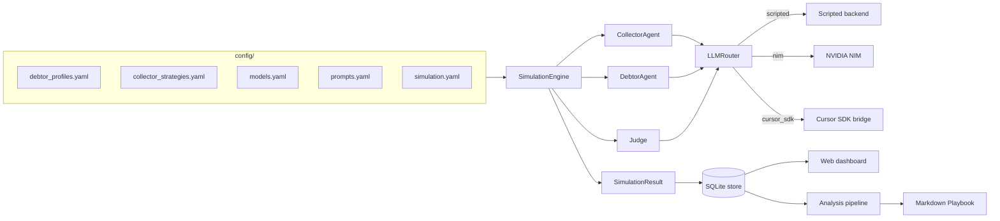

Collection Swarm · v0.1

# Synthetic conversations. Real-world clarity.

A Python simulator that pits an AI Collector against an AI Debtor under the
watchful eye of an AI Judge — so collection teams can stress-test scripts,
strategies, and models <em>before</em> they ever touch a real customer.

[:material-rocket-launch-outline: Get started](getting-started/install.md){ .md-button .md-button--primary }
[:material-book-open-page-variant-outline: Read the concepts](concepts/index.md){ .md-button }
[:material-source-branch: View on GitHub](https://github.com/pedrochagasmaster/collection-swarm){ .md-button }

## What you can do with it { .no-rule }

### [Run a simulation](getting-started/install.md)
A single Collector × Debtor × Judge conversation with one CLI call. No API
keys needed for the offline scripted backend.

### [Run a matrix](modules/runner.md)
Sweep every Profile × Strategy × Model combination with bounded concurrency,
then analyze the results.

### [Run a tournament](modules/arena.md)
Elo-rate every Strategy against every Profile across Swiss or round-robin
rounds and watch the leaderboard converge.

### [Evolve strategies](modules/evolution.md)
Use a strong model to mutate the bottom of the leaderboard into new
candidate strategies, generation after generation.

### [Browse the dashboard](getting-started/dashboard.md)
A FastAPI + vanilla-JS SPA exposes runs, transcripts, leaderboards,
playbooks, and a live manual role-play sandbox.

### [Plug in real models](getting-started/live-models.md)
Native NVIDIA NIM and Cursor SDK backends. Bring your own keys, or stay
fully offline with the deterministic scripted backend.

## How the system thinks { .no-rule }

A run flows left-to-right. Configuration drives the engine, the engine
runs three agents through one router, and the resulting `SimulationResult`
is the substrate every downstream report builds on.

## Read it like a book { .no-rule }

This documentation is laid out the way a careful reader would explore the
codebase: from the surface, down through the concepts, into each individual
module, and back out to the operator references.

### [1 · Getting started](getting-started/index.md)
Install the package, run the first offline simulation, point it at a real
provider, and open the dashboard.

### [2 · Concepts](concepts/index.md)
The vocabulary, the domain model, the conversation lifecycle, and the
guardrails that govern compliance, the arena, and the judge.

### [3 · Modules](modules/index.md)
A deep, file-by-file walkthrough of every module under
`src/collection_swarm/`, with diagrams, type signatures, and gotchas.

### [4 · Reference](reference/index.md)
Operator-level reference for the CLI, the HTTP API, the YAML configuration
files, and the SQLite schema.

## Project provenance { .no-rule }

Collection Swarm is calibrated to the Brazilian post-liquidation context for
Will Bank (BCB extrajudicial liquidation, 2026-01-21). Every Profile and
Strategy in the bundled catalog cites a real-world source — see the
[Will Bank research dossier](https://github.com/pedrochagasmaster/collection-swarm/blob/main/docs/willbank-research-dossier.md)
for the full bibliography.

!!! warning "Synthetic data only"
    Profiles, debtors, and conversations in this repository are entirely
    synthetic. Do not ingest real consumer records, do not treat Judge output
    as legal advice, and do not deploy a strategy without human review. See
    [Compliance & guardrails](concepts/compliance.md).
